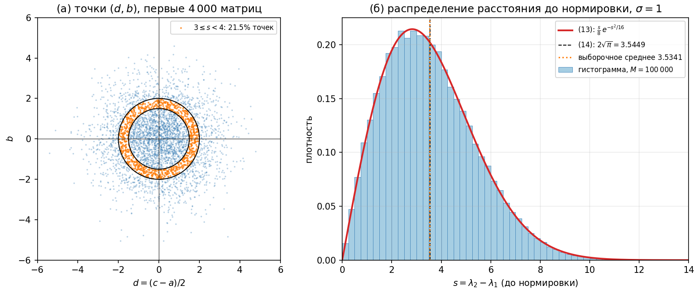
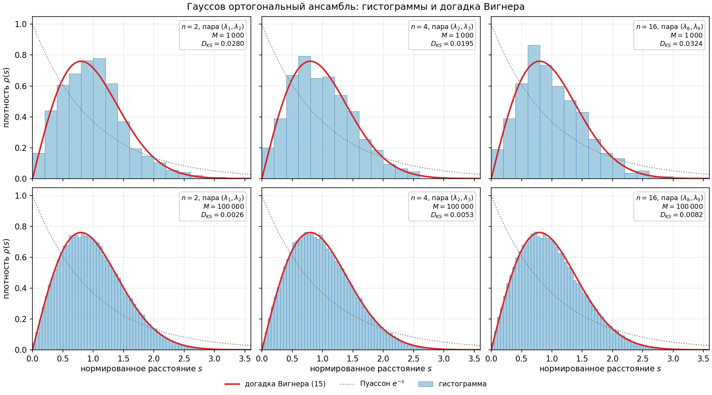
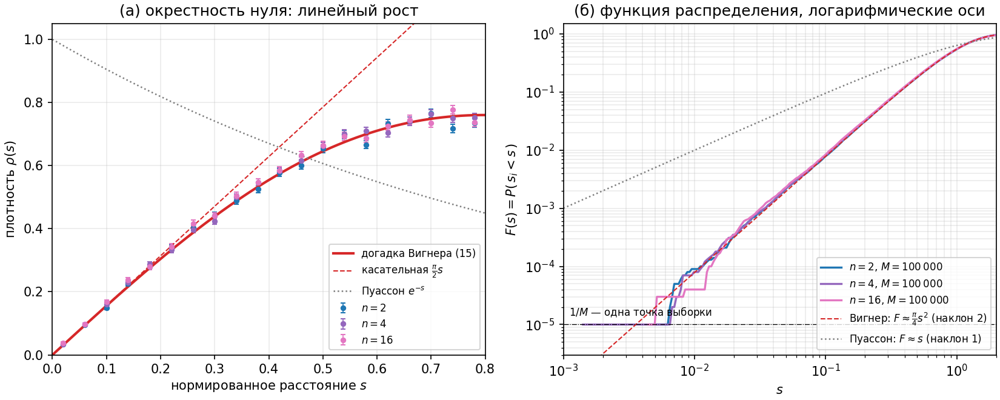
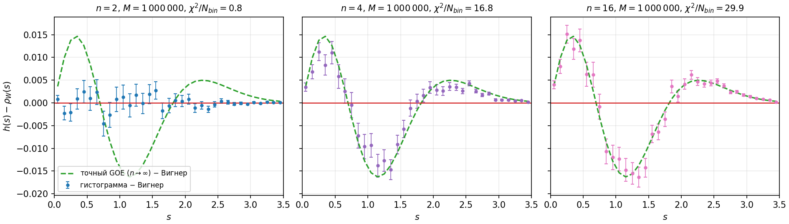
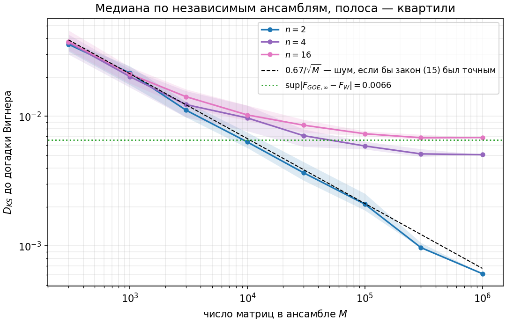
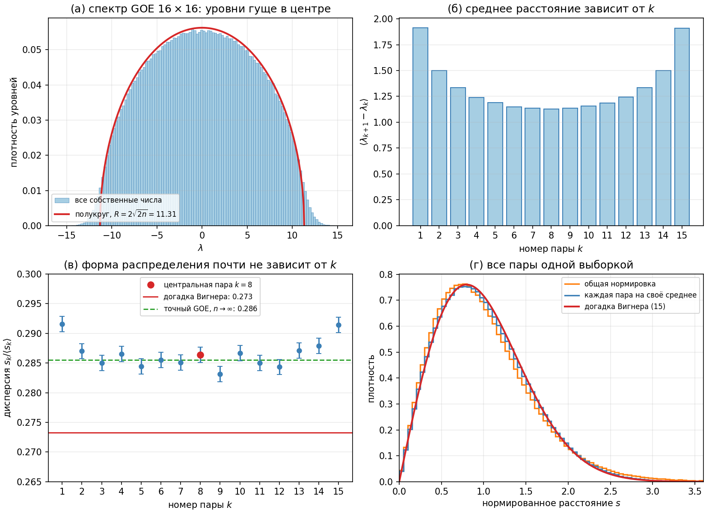
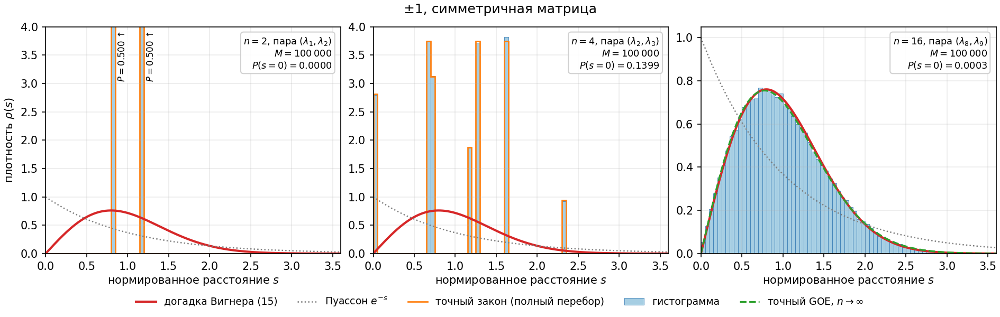
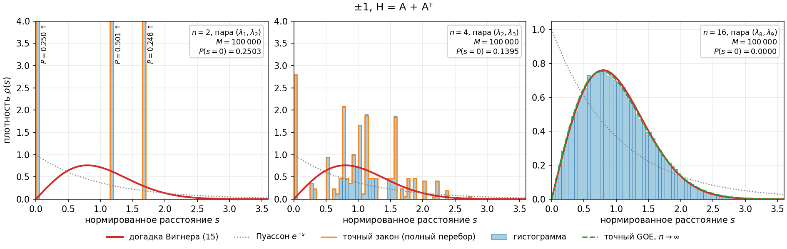
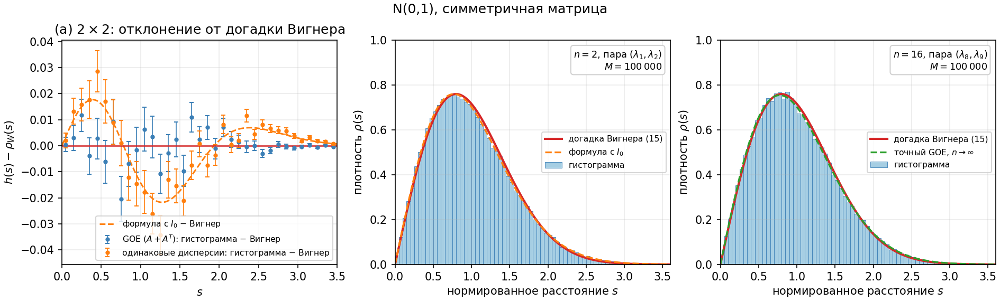

# Лабораторная работа 2. Свойства случайных матриц

**Отчёт.** Распределение расстояний между соседними собственными числами
случайных симметричных матриц 2×2, 4×4, 16×16 и его сравнение с догадкой
Вигнера (15)
$\rho(s) = \dfrac{\pi s}{2}\, e^{-\pi s^2/4}$.

Код: пакет [`level_spacing`](src/level_spacing) (Python, NumPy/SciPy/Matplotlib).
Все числа и рисунки ниже получены одной командой
`python -m level_spacing report` (≈ 50 с, зерно генератора 2026) и
воспроизводятся до последнего знака. Полные таблицы:
[results/tables.md](results/tables.md), все числа в машиночитаемом виде:
[results/summary.json](results/summary.json).

## Кратко о результатах

1. **Гауссов ансамбль, 2×2.** Догадка Вигнера для 2×2 не приближение, а
   точный закон. Даже при $M = 10^6$ матриц гистограмма не отличима от (15):
   $D_{KS} = 0.0006$, $p = 0.63$; критерий $\chi^2$: 37 при 38 степенях
   свободы.
2. **4×4 и 16×16.** Кривая (15) очень близка к гистограмме: максимальное
   расхождение плотностей 0.016, это 2 % от высоты пика. Но расхождение
   *систематическое*: дисперсия нормированного расстояния равна 0.2824 (4×4)
   и 0.2857 (16×16) против 0.2732 у (15). При $M = 1000$ матриц этого не
   видно, при $M \gtrsim 10^4$ — видно уверенно. Гистограмма 16×16
   совпадает с **точным** законом GOE при $n \to \infty$ (закон
   Годена–Меты, посчитан через определитель Фредгольма): $p = 0.62$ при
   $M = 10^6$.
3. **Около нуля** (пункт 6) плотность растёт линейно, $\rho(s) \approx \frac{\pi}{2}s$.
   Это отталкивание уровней: совпадение двух собственных чисел требует
   выполнения сразу *двух* условий ($b = 0$ и $d = 0$). Расстояние меньше
   0.1 встречается в 0.8 % случаев, а у независимых уровней (закон
   Пуассона) было бы 9.5 %.
4. **Матрицы из ±1, 2×2 и 4×4** (пункт 9). Распределение дискретное
   (несколько атомов) и на догадку Вигнера не похоже. Отталкивания нет:
   пары бывают вырождены с вероятностью 1/4 (2×2, $A + A^T$) и 9/64 (4×4).
   **16×16**: распределение уже почти совпадает с GOE. Это проявление
   *универсальности*: локальная статистика уровней не зависит от закона
   распределения элементов.
5. **Аналитика для 2×2 из ±1** (пункт 10) выведена для обеих трактовок
   задания и совпала с полным перебором и с моделированием.

---

## 1. Методика

### 1.1. Ансамбли

Собственные числа несимметричной матрицы, вообще говоря, комплексные,
поэтому, как в разделе 1.3 методички, матрица с независимыми элементами
$A$ симметризуется.

| Ансамбль | Как строится $H$ | Элементы $H$ | Где |
|---|---|---|---|
| `goe` | $A_{ij} \sim \mathcal N(0,1)$, $H = A + A^T$ | диагональ $\mathcal N(0, 4)$, вне диагонали $\mathcal N(0, 2)$ | пункты 1–8 |
| `pm1` | $H_{ij} = H_{ji} = \pm 1$ при $i \le j$ | $\pm 1$ | пункт 9, трактовка (а) |
| `pm1-sum` | $A_{ij} = \pm 1$, $H = A + A^T$ | диагональ $\pm 2$, вне диагонали $0, \pm 2$ | пункт 9, трактовка (б) |
| `normal-mirror` | $H_{ij} = H_{ji} \sim \mathcal N(0,1)$ при $i \le j$ | все $\mathcal N(0, 1)$ | для сравнения, раздел 6 |

Пункт 9 допускает два прочтения. Если «матрицы, элементы которых принимают
значения ±1» — то это сама симметричная матрица из ±1 (трактовка (а)).
Если «повторите все вышеперечисленные шаги» — то это та же симметризация
$A + A^T$ с $A$ из ±1 (трактовка (б)). Результаты у них качественно разные,
поэтому сделаны обе.

### 1.2. Алгоритм (пункты 1–5)

```python
H  = sample_matrices("goe", n=16, size=100_000)   # 1. ансамбль
ev = eigenvalues(H)                               # 2. спектры по возрастанию (LAPACK)
s  = pair_spacings(ev, k=8)                       # 3. λ9 − λ8 для каждой матрицы
x  = normalize(s)                                 # 4. x = s / ⟨s⟩, среднее = 1
histogram(x, edges)                               # 5. гистограмма-плотность
```

- **Пара уровней фиксирована** (сноски 2 и 4): берётся центральная пара
  $k = n/2$, то есть $(\lambda_1, \lambda_2)$, $(\lambda_2, \lambda_3)$ и
  $(\lambda_8, \lambda_9)$ для $n = 2, 4, 16$. В центре спектра плотность
  уровней максимальна и почти постоянна. Почему пары нельзя смешивать,
  показано в разделе 3.4.
- **Объём ансамбля.** Основной $M = 10^5$ матриц. Минимальный по заданию
  $M = 10^3$ показан для сравнения. Для точного сравнения с теорией
  использован $M = 10^6$. Матрицы генерируются порциями по 50 000, поэтому
  память не растёт с $M$.
- **Проверка собственных чисел.** Для 1000 матриц каждого размера спектр
  пересчитан методом Якоби из лабораторной работы 1. Максимальное
  расхождение с LAPACK: $1.8 \cdot 10^{-15}$, $7.1 \cdot 10^{-15}$ и
  $2.7 \cdot 10^{-14}$ для $n = 2, 4, 16$.

### 1.3. Как измеряется «близость» (пункт 8)

| Мера | Что показывает |
|---|---|
| $D_{KS} = \sup_s \lvert F_M(s) - F(s) \rvert$ | расстояние Колмогорова–Смирнова, от бинов не зависит |
| критерий $\chi^2$ по бинам ширины 0.1 | согласие гистограммы с кривой; одна степень свободы снята за нормировку |
| $L_1 = \int \lvert h(s) - \rho(s) \rvert\, ds$ | площадь между гистограммой и кривой (0 — совпадение, 2 — ничего общего) |
| дисперсия $x$ | у (15) она равна $4/\pi - 1 = 0.2732$ |
| показатель $\gamma$ в $F(s) \propto s^\gamma$ при малых $s$ | $\gamma = 2$ — линейное отталкивание, $\gamma = 1$ — его нет |

Выборка нормируется на *собственное* среднее, поэтому табличное
распределение Колмогорова даёт сильно завышенные p-значения (эффект
Лиллиефорса). Нулевое распределение $D\sqrt M$ построено моделированием:
1000 выборок точно из проверяемого закона, каждая нормирована на своё
среднее. Для такой выборки типичное значение $D \approx 0.67/\sqrt M$, а
не $0.87/\sqrt M$. Наименьшее возможное p-значение этого метода —
$10^{-3}$, в таблицах это «$p < 0.001$».

---

## 2. Проверка теоретической части на матрицах 2×2



**Рисунок 1.** (а) Точки $(d, b)$ для 4000 матриц 2×2 гауссова ансамбля и
кольцо рисунка 1 методички. (б) Распределение $s = \lambda_2 - \lambda_1$
до нормировки и формула (13).

Численно подтверждены все утверждения раздела 1.3 ($M = 10^5$):

- дисперсии элементов $H = A + A^T$: $\sigma_a^2 = 3.99$ (теория 4),
  $\sigma_b^2 = 1.98$ (теория 2), $\sigma_d^2 = 1.995$ (теория 2). Точка
  $(d, b)$ распределена изотропно, как в (9);
- формула (5) $s = 2\sqrt{d^2 + b^2}$ выполняется для каждой матрицы с
  точностью $1.8 \cdot 10^{-15}$;
- среднее (14): $\langle s \rangle = 3.5469 \pm 0.0019$ при $M = 10^6$,
  теория $2\sqrt\pi = 3.5449$ (расхождение 1.0σ);
- гистограмма до нормировки ложится на (13), после нормировки — на (15).

Рисунок 1(а) показывает, откуда берётся отталкивание. Плотность точек
$(d, b)$ *максимальна* в нуле, но $s$ — это удвоенный *радиус*. Доля точек
с $s$ в интервале $[s, s + \Delta)$ пропорциональна площади кольца
$\tfrac12 \pi s \Delta$ (формула (6)), а она обращается в ноль при $s \to 0$.

### Замечания к тексту методички

При проверке выкладок нашлось несколько неточностей. Итоговые формулы (13)
и (15) верны.

1. **Формула (8):** левый нижний элемент $A + A^T$ равен $C + B$, а не
   $D + C$. Соответственно $\sigma_b = \sqrt{\sigma_B^2 + \sigma_C^2}$, а не
   $\sqrt{\sigma_B^2 + \sigma_D^2}$. Численно ответ тот же, $\sqrt 2$.
2. **Формула (11):** $\delta(s^2 - 4b^2 - 4d^2)$ как плотность по $s$
   теряет множитель $2s$. Правильно
   $\rho(s) = \int \rho(b, d)\, \delta\bigl(s - 2\sqrt{b^2 + d^2}\bigr)\, db\, dd$.
3. **Формула (12):** $\delta(s - 2r) = \tfrac12 \delta(r - s/2)$, и
   множитель $\tfrac12$ пропущен. Буквально (12) даёт
   $\tfrac{s}{4} e^{-s^2/16}$, а интеграл этой функции равен 2, а не 1.
   С множителем получается (13).
4. **Формула (14):** должно быть $\langle s \rangle = \int s\, \rho(s)\, ds$,
   а не $\int s\, d\rho(s)$.

---

## 3. Гауссов ортогональный ансамбль (пункты 1–8)

### 3.1. Гистограммы и график (15) — пункты 5 и 7



**Рисунок 2.** Гистограммы нормированных расстояний и догадка Вигнера (15).
Верхний ряд — минимальный по заданию ансамбль ($M = 1000$), нижний —
$M = 10^5$. Серым пунктиром для сравнения показан закон Пуассона
$e^{-s}$: так были бы распределены расстояния между *независимыми* уровнями.

### 3.2. Поведение около нуля — пункт 6



**Рисунок 3.** (а) Начало гистограмм крупным планом, с погрешностями.
(б) Эмпирическая функция распределения в логарифмических осях.

**Что видно.** Гистограмма в нуле *равна нулю* и растёт линейно, как
касательная $\frac{\pi}{2} s$. Это прямо противоположно закону Пуассона,
у которого плотность в нуле максимальна. В логарифмических осях функция
распределения идёт с наклоном 2: $F(s) \propto s^2$, то есть
$\rho(s) \propto s$.

| $n$ | $P(s < 0.05)$, $M = 10^5$ | $P(s < 0.1)$, $M = 10^5$ | $\gamma$, $M = 10^6$ |
|---|---|---|---|
| 2 | 0.0022 | 0.0079 | 1.97 |
| 4 | 0.0022 | 0.0081 | 1.98 |
| 16 | 0.0023 | 0.0084 | 1.96 |
| догадка Вигнера | 0.0020 | 0.0078 | 1.98 |
| закон Пуассона | 0.049 | 0.095 | 0.95 |

Показатель $\gamma$ оценён методом максимального правдоподобия на отрезке
$[0, 0.2]$. На этом отрезке законы степенные лишь приближённо, поэтому та
же оценка для самих теоретических кривых даёт 1.98 и 0.95, а не ровно 2 и
1. С этими значениями и нужно сравнивать.

**Почему так.** Это явление *отталкивания уровней*.

1. **Подсчёт условий.** Чтобы два собственных числа матрицы 2×2 совпали,
   нужно $s = 2\sqrt{d^2 + b^2} = 0$, то есть *одновременно* $b = 0$ и
   $d = 0$ — два независимых условия. Для случайной величины с непрерывным
   законом каждое из них имеет вероятность 0, а «почти выполняется» с
   вероятностью порядка допуска. Поэтому $P(s < \varepsilon) \propto \varepsilon^2$,
   а плотность $\propto \varepsilon$. Геометрически это площадь круга
   радиуса $\varepsilon/2$ на плоскости $(d, b)$ (формула (6) и
   рисунок 1(а)). Это теорема фон Неймана–Вигнера о непересечении уровней:
   вырождение в семействе вещественных симметричных матриц имеет
   коразмерность 2.
2. **Для любого $n$.** Совместная плотность собственных чисел GOE равна
   $P(\lambda_1, \dots, \lambda_n) \propto \prod_{i<j} \lvert \lambda_i - \lambda_j \rvert\, e^{-\sum_i \lambda_i^2 / 8}$.
   Множитель $\lvert \lambda_i - \lambda_j \rvert$ — якобиан перехода от
   элементов матрицы к собственным числам. Он зануляет плотность при сближении
   любых двух уровней, поэтому линейное поведение около нуля одинаково для
   2×2, 4×4 и 16×16. Это видно и в таблице.
3. **Для сравнения.** Если бы уровни были независимы, как для диагональной
   матрицы со случайной диагональю, малые расстояния были бы *самыми
   частыми*: $\rho(s) = e^{-s}$.

### 3.3. Насколько график близок к гистограмме — пункт 8

**Основной ансамбль, $M = 10^5$:**

| $n$ | пара | $\langle s \rangle$ до нормировки | дисперсия $x$ | $D_{KS}$ до (15) | $\chi^2$ / ст. св. | $L_1$ до (15) | $D_{KS}$ до GOE$_\infty$ |
|---|---|---|---|---|---|---|---|
| 2 | (1, 2) | 3.534 ± 0.006 | 0.2737 ± 0.0013 | 0.0026 ($p = 0.20$) | 45 / 33 ($p = 0.08$) | 0.014 | 0.0070 ($p < 0.001$) |
| 4 | (2, 3) | 2.382 ± 0.004 | 0.2812 ± 0.0014 | 0.0053 ($p < 0.001$) | 82 / 33 ($p = 5 \cdot 10^{-6}$) | 0.017 | 0.0030 ($p = 0.06$) |
| 16 | (8, 9) | 1.126 ± 0.002 | 0.2868 ± 0.0014 | 0.0082 ($p < 0.001$) | 158 / 33 ($p < 10^{-10}$) | 0.026 | 0.0018 ($p = 0.78$) |

**Большой ансамбль, $M = 10^6$:**

| $n$ | дисперсия $x$ | $D_{KS}$ до (15) | $\chi^2$ / ст. св. | $L_1$ до (15) | $D_{KS}$ до GOE$_\infty$ |
|---|---|---|---|---|---|
| 2 | 0.2730 ± 0.0004 | **0.0006** ($p = 0.63$) | **37 / 38** ($p = 0.52$) | 0.004 | 0.0065 ($p < 0.001$) |
| 4 | 0.2824 ± 0.0004 | 0.0051 ($p < 0.001$) | 690 / 38 | 0.017 | 0.0019 ($p < 0.001$) |
| 16 | 0.2857 ± 0.0004 | 0.0069 ($p < 0.001$) | 1284 / 38 | 0.023 | **0.0006** ($p = 0.62$) |
| теория | 0.2732 (Вигнер), 0.2855 (GOE$_\infty$) | | | | |

«GOE$_\infty$» — точный закон расстояний GOE при $n \to \infty$. Он
выражается через вероятность $E(0; s)$ отсутствия уровней на отрезке длины
$s$: $p(s) = E''(s)$, где $E(0; s)$ — определитель Фредгольма
$\det(I - K_s)$ с ядром $\operatorname{sinc}(x - y) + \operatorname{sinc}(x + y)$
на $(0, s/2)$ (Мета [2]). Определитель посчитан квадратурой
Гаусса–Лежандра по методу Борнемана [3]. Контроль: получившийся закон
нормирован, имеет среднее 1, дисперсию 0.2855 (табличное значение) и наклон
$\pi^2/6$ в нуле.



**Рисунок 4.** Разность «гистограмма минус (15)» для $M = 10^6$ с
погрешностями (одна сигма). Зелёная кривая — разность «точный закон
GOE$_\infty$ минус (15)».



**Рисунок 5.** Как $D_{KS}$ до догадки Вигнера зависит от числа матриц
$M$. Показана медиана по 30 независимым ансамблям каждого размера, полоса —
квартили. Пунктир — уровень шума, если бы (15) была точной.

**Выводы по пункту 8.**

- **Для 2×2 кривая совпадает с гистограммой в пределах статистической
  погрешности при любом $M$.** На рисунке 4 точки разбросаны около нуля
  ($\chi^2/N_{bin} = 0.8$). На рисунке 5 $D_{KS}$ убывает как
  $0.67/\sqrt M$ вплоть до $M = 10^6$. Так и должно быть: для 2×2 формула
  (15) выведена точно.
- **Для 4×4 и 16×16 кривая близка к гистограмме, но не совпадает с ней.**
  Разность плотностей волнообразна: гистограмма чуть выше кривой при
  $s \approx 0.3$ и $s \approx 2.3$ и ниже при $s \approx 1.2$. Амплитуда
  до 0.016, это 2 % от высоты пика 0.76. Площадь расхождения
  $L_1 \approx 0.02$. Распределение шире, чем по (15): дисперсия больше на
  3.4 % (4×4) и 4.6 % (16×16).
- **Расхождение — свойство формулы (15), а не погрешность расчёта.**
  Точки для 16×16 на рисунке 4 ложатся на зелёную кривую
  «GOE$_\infty$ − Вигнер», а $D_{KS}$ на рисунке 5 выходит на полку
  $0.0069 \approx \sup \lvert F_{GOE,\infty} - F_W \rvert = 0.0066$. С точным
  законом GOE$_\infty$ гистограмма 16×16 согласуется и при $M = 10^6$
  ($D = 0.0006$, $p = 0.62$). Значит, уже при $n = 16$ центральная пара
  практически достигла предела $n \to \infty$. Формула (15), выведенная для
  2×2, описывает этот предел с погрешностью около 2 % по плотности.
- **4×4 — промежуточный случай.** При $M = 10^6$ он отличим и от (15), и
  от GOE$_\infty$ ($D = 0.0019$): поправки конечного размера ещё заметны.
  По дисперсии он лежит между ними: 0.2732 < 0.2824 < 0.2855.
- **При минимальном ансамбле ($M = 1000$) отличие не обнаружить.**
  Статистический шум $0.67/\sqrt{1000} = 0.021$ втрое больше
  систематического расхождения 0.0066. Медианные $D_{KS}$ по 30 ансамблям
  одинаковы для всех трёх размеров (0.020–0.022), критерий $\chi^2$ для
  всех трёх даёт $p = 0.22–0.39$. Различие становится заметным при
  $M \gtrsim 10^4$, когда шум опускается ниже 0.0066 (рисунок 5).

### 3.4. Почему пара уровней фиксирована (сноски 2 и 4)



**Рисунок 8.** GOE 16×16, $M = 10^5$. (а) Плотность уровней и закон
полукруга радиуса $2\sqrt{2n}$. (б) Среднее расстояние для каждой пары.
(в) Дисперсия нормированного расстояния для каждой пары. (г) Все 15 пар
одной выборкой.

- Плотность уровней неоднородна (закон полукруга), поэтому среднее
  расстояние у края спектра в 1.7 раза больше, чем в центре: 1.91 против
  1.13 (панель (б)).
- *Форма* распределения после нормировки каждой пары на её собственное
  среднее почти не зависит от $k$: дисперсия 0.283–0.288 в центре и
  0.291 у краёв (панель (в)). Это универсальность локальной статистики.
- Если же смешать все пары и нормировать на *общее* среднее, получится
  смесь законов с разными масштабами: дисперсия 0.334, $D_{KS} = 0.025$ до
  (15) (оранжевая линия на панели (г)). Если же сначала нормировать каждую
  пару на своё среднее (простейшее «развёртывание» спектра), получается
  дисперсия 0.286 и $D_{KS} = 0.007$ — в 3.5 раза меньше.

Поэтому сноска 2 права: фиксированная пара даёт чистый результат без
развёртывания спектра. Центральная пара лучше крайних.

---

## 4. Матрицы из ±1 (пункт 9)



**Рисунок 6.** Трактовка (а): симметричная матрица из ±1. Оранжевый контур —
точный закон из полного перебора всех $2^{n(n+1)/2}$ матриц (8 для 2×2,
1024 для 4×4). Для обрезанных столбцов подписана их вероятность.



**Рисунок 7.** Трактовка (б): $H = A + A^T$, $A$ из ±1. Полный перебор:
16 и 65 536 матриц.

| Ансамбль | $n$ | дисперсия $x$ | $P(s = 0)$ | $D_{KS}$ до (15) | $D_{KS}$ до GOE$_\infty$ | $\gamma$ |
|---|---|---|---|---|---|---|
| ±1, (а) | 2 | 0.0294 | 0 | 0.417 | 0.423 | — |
| ±1, (а) | 4 | 0.341 | 0.140 | 0.177 | 0.178 | — |
| ±1, (а) | 16 | 0.283 | 0.0003 | 0.0050 | 0.0034 ($p = 0.01$) | 1.91 |
| ±1, (б) | 2 | 0.373 | 0.250 | 0.410 | 0.412 | — |
| ±1, (б) | 4 | 0.347 | 0.140 | 0.140 | 0.140 | — |
| ±1, (б) | 16 | 0.283 | 0 | 0.0064 | 0.0023 ($p = 0.36$) | 2.02 |
| GOE | 16 | 0.287 | 0 | 0.0082 | 0.0018 ($p = 0.78$) | 1.92 |

$M = 10^5$ для всех строк. Прочерк в столбце $\gamma$ означает, что
ненулевых расстояний меньше 0.2 нет вовсе.

**Малые матрицы (2×2, 4×4).** Элементы принимают конечное число значений,
поэтому и расстояние принимает конечное число значений: 2 или 3 атома для
2×2, 8 (а) или 40 (б) атомов для 4×4. Гистограмма — это набор пиков, и
с кривой (15) она не имеет ничего общего ($D_{KS} = 0.14–0.42$). Частоты
пиков совпадают с точным законом из перебора (рисунки 6–7, раздел 5).

**Поведение около нуля.** Рассуждение о «двух условиях» из раздела 3.2
требует непрерывности закона элементов. Для дискретного закона событие
$\{b = 0, d = 0\}$ имеет *положительную* вероятность. Поэтому:

- в трактовке (б) пара 2×2 вырождена с вероятностью
  $P(b = 0) \cdot P(d = 0) = \tfrac12 \cdot \tfrac12 = \tfrac14$ (измерено
  0.2503). Над нулём стоит пик, а не провал, — отталкивания нет;
- в трактовке (а) $b = \pm 1$ никогда не равно нулю, поэтому $s \ge 2$
  всегда (после нормировки $x \ge 0.828$). Это не статистическое
  отталкивание, а жёсткая «щель», следствие $b^2 = 1$;
- для 4×4 обе трактовки дают вырожденную центральную пару примерно в 14 %
  матриц (точно: 9/64 и 9168/65 536).

**16×16 — универсальность.** С ростом $n$ дискретность перестаёт
сказываться. Для 16×16 обе гистограммы практически совпадают с
гауссовым случаем: дисперсия 0.283, линейное отталкивание $\gamma \approx 2$,
согласие с GOE$_\infty$ на уровне $D_{KS} = 0.002–0.003$. Вырожденные пары
почти исчезают: 3 на 10 000 в трактовке (а), ни одной на $10^5$ в (б).
Локальная статистика уровней не зависит от закона распределения элементов,
если они независимы и имеют одинаковую дисперсию (теоремы
универсальности, см. Тао и Ву [4]). У трактовки (а) при $n = 16$ ещё
видно слабое отличие от GOE$_\infty$ ($p = 0.01$). Это остаточный эффект
дискретности, в том числе редкие точные вырождения.

---

## 5. Аналитические результаты для 2×2 из ±1 (пункт 10)

Везде используется формула (5): $s = 2\sqrt{d^2 + b^2}$, $d = (c - a)/2$.

### (а) Симметричная матрица из ±1

$H = \begin{bmatrix} a & b \\ b & c \end{bmatrix}$, где $a, b, c = \pm 1$
независимо и равновероятно. Всего 8 матриц.

- $b^2 = 1$ всегда.
- $d = 0$, если $a = c$ (вероятность 1/2), и $d = \pm 1$, если $a \ne c$
  (вероятность 1/2).

Отсюда

$$
s = \begin{cases} 2, & a = c \quad (\text{вероятность } 1/2), \\ 2\sqrt 2, & a \ne c \quad (\text{вероятность } 1/2). \end{cases}
$$

Спектры: при $a = c$ матрица равна $aI + b\sigma_x$ и имеет собственные
числа $\{0, 2\}$ или $\{-2, 0\}$ (по 1/4). При $a = -c$ получается
$a\sigma_z + b\sigma_x$ с собственными числами $\pm\sqrt 2$ (1/2).

Среднее $\langle s \rangle = 1 + \sqrt 2 \approx 2.4142$. После нормировки

$$
\rho(x) = \tfrac12\, \delta\bigl(x - (2\sqrt2 - 2)\bigr) + \tfrac12\, \delta\bigl(x - (4 - 2\sqrt2)\bigr),
\qquad 2\sqrt2 - 2 \approx 0.828,\quad 4 - 2\sqrt2 \approx 1.172,
$$

$\langle x^2 \rangle = 18 - 12\sqrt2$, дисперсия $17 - 12\sqrt 2 \approx 0.0294$.
Это в 9 раз меньше, чем у догадки Вигнера (0.2732).

### (б) $H = A + A^T$, $A$ из ±1

$a = 2\alpha$, $c = 2\gamma$, $b = \beta_1 + \beta_2$, где
$\alpha, \gamma, \beta_1, \beta_2 = \pm 1$ независимы. Всего 16 матриц.

- $d = \gamma - \alpha \in \{-2, 0, 2\}$ с $P(d = 0) = 1/2$.
- $b \in \{-2, 0, 2\}$ с $P(b = 0) = 1/2$.
- $d$ и $b$ независимы (зависят от разных элементов $A$).

$$
s = \begin{cases} 0, & b = d = 0 \quad (1/4), \\ 4, & \text{ровно одно из } b, d \text{ равно } 0 \quad (1/2), \\ 4\sqrt2, & b, d \ne 0 \quad (1/4). \end{cases}
$$

Среднее $\langle s \rangle = 2 + \sqrt 2 \approx 3.4142$. После нормировки

$$
\rho(x) = \tfrac14\, \delta(x) + \tfrac12\, \delta\bigl(x - (4 - 2\sqrt2)\bigr) + \tfrac14\, \delta\bigl(x - (4\sqrt2 - 4)\bigr),
\qquad 4\sqrt2 - 4 \approx 1.657,
$$

$\langle x^2 \rangle = 24 - 16\sqrt2$, дисперсия $23 - 16\sqrt2 \approx 0.3726$.
Распределение шире вигнеровского.

### Проверка

| Трактовка | $s$ | $P$ аналитически | $P$ перебором | частота, $M = 10^5$ |
|---|---|---|---|---|
| (а) | 2 | 1/2 | 0.5000 | 0.5004 |
| (а) | $2\sqrt2$ | 1/2 | 0.5000 | 0.4996 |
| (б) | 0 | 1/4 | 0.2500 | 0.2503 |
| (б) | 4 | 1/2 | 0.5000 | 0.5012 |
| (б) | $4\sqrt2$ | 1/4 | 0.2500 | 0.2484 |

Средние до нормировки по моделированию: $2.4139 \pm 0.0013$ (а) и
$3.4103 \pm 0.0066$ (б) — в пределах погрешности от $1 + \sqrt2$ и
$2 + \sqrt2$.

**Сравнение с гауссовым случаем.** В гауссовом ансамбле $(d, b)$ —
изотропная нормальная точка на плоскости, и $s$ имеет распределение Рэлея
(13). В случае ±1 точка $(d, b)$ может занимать лишь несколько узлов
решётки, и $s$ — это расстояние от начала координат до узла:
$\{2, 2\sqrt2\}$ в случае (а) и $\{0, 4, 4\sqrt2\}$ в случае (б).
Непрерывного распределения, а с ним и отталкивания, не возникает.

Для 4×4 аналитический вывод громоздок, но полный перебор даёт точный закон
(все атомы — в [results/tables.md](results/tables.md)). Например, в
трактовке (а) центральная пара вырождена ровно в $9/64$ случаев, а
остальные 7 атомов лежат в диапазоне $x \in [0.67, 2.35]$.

---

## 6. Дополнительно: зачем складывать $A + A^T$

Симметричную матрицу можно получить и иначе: взять независимые
$\mathcal N(0,1)$ на диагонали и над ней и отразить (ансамбль
`normal-mirror`). Тогда у всех элементов одинаковая дисперсия 1. Для 2×2
получается $b \sim \mathcal N(0, 1)$, но $d = (c - a)/2 \sim \mathcal N(0, 1/2)$:
точка $(d, b)$ распределена *анизотропно*. Интегрирование по углу даёт
функцию Бесселя вместо константы:

$$
\rho(s) = \frac{s}{2\sqrt2}\, e^{-3s^2/16}\, I_0\!\left(\frac{s^2}{16}\right),
\qquad \langle s \rangle = 2\sqrt{2/\pi}\, E(1/2) \approx 2.155,
$$

где $E$ — полный эллиптический интеграл второго рода. Дисперсия после
нормировки $6/\langle s\rangle^2 - 1 = 0.2916$ вместо 0.2732.



**Рисунок 9.** (а) Отклонение от (15) для 2×2: GOE (синие точки) и
одинаковые дисперсии (оранжевые точки, пунктир — формула с $I_0$).
(б, в) Гистограммы для 2×2 и 16×16.

Моделирование подтверждает формулу: $D_{KS} = 0.0023$ ($p = 0.36$),
$\chi^2 = 46/36$. От (15) отличие уверенное: $D = 0.011$, $\chi^2 = 503/33$.
Удвоение дисперсии диагонали при $A + A^T$ — не случайность: только при
соотношении дисперсий 2 : 1 плотность матрицы
$\propto \exp(-\operatorname{tr} H^2/8)$ зависит лишь от спектра, то есть
ансамбль ортогонально инвариантен. Это и есть GOE, и только для него (15)
точна при $n = 2$. Для 16×16 разница исчезает (рисунок 9(в),
$D_{KS}$ до GOE$_\infty$ = 0.0024) — снова универсальность.

---

## 7. Выводы (пункт 11)

1. Для гауссова ортогонального ансамбля расстояние между соседними
   уровнями распределено почти по догадке Вигнера при всех $n$. Для 2×2 это
   точный закон: подтверждено с точностью $D_{KS} = 6 \cdot 10^{-4}$ на
   миллионе матриц.
2. Для $n \ge 4$ догадка Вигнера — приближение с погрешностью около 2 % по
   плотности и 4–5 % по дисперсии. Чтобы это заметить, нужно
   $M \gtrsim 10^4$ матриц. При минимальных $M = 1000$ отличие тонет в
   шуме. Уже при $n = 16$ центральная пара описывается точным законом GOE
   при $n \to \infty$, поэтому для больших матриц точнее сравнивать с ним,
   а не с (15).
3. Около нуля плотность линейна, $\rho(s) \approx \frac{\pi}{2}s$
   (отталкивание уровней). Причина — коразмерность 2 вырождения для
   вещественных симметричных матриц, или, что то же самое, множитель
   $\prod \lvert \lambda_i - \lambda_j \rvert$ в совместной плотности
   собственных чисел.
4. Для матриц из ±1 малого размера распределение дискретное, и
   отталкивания нет. При $A + A^T$ пара 2×2 вырождена в четверти случаев,
   у симметричной матрицы из ±1 наоборот есть жёсткая щель $x \ge 0.83$.
   Оба закона выведены аналитически и подтверждены перебором и
   моделированием. С ростом $n$ распределение быстро приближается к
   гауссову: при $n = 16$ оно почти неотличимо от GOE. Локальная
   статистика уровней универсальна и не зависит от деталей распределения
   элементов.
5. Методически важно (а) фиксировать пару уровней — иначе смешиваются
   законы с разным масштабом, и отклонение от (15) вырастает в 3.5 раза;
   (б) симметризовать именно $A + A^T$ — иначе для 2×2 формула (15)
   перестаёт быть точной.

## Литература

1. E. Wigner. Characteristic vectors of bordered matrices with infinite
   dimensions // Annals of Mathematics, 1955.
2. М. Л. Мета. Случайные матрицы. — М.: МЦНМО, 2012. (Гл. 6–7: закон
   расстояний GOE через $E(0; s)$.)
3. F. Bornemann. On the numerical evaluation of Fredholm determinants //
   Mathematics of Computation, 2010, V. 79, pp. 871–915.
4. T. Tao, V. Vu. Random matrices: universality of local eigenvalue
   statistics // Acta Mathematica, 2011, V. 206, pp. 127–204.
5. H. W. Lilliefors. On the Kolmogorov–Smirnov test for normality with
   mean and variance unknown // JASA, 1967, V. 62, pp. 399–402.
