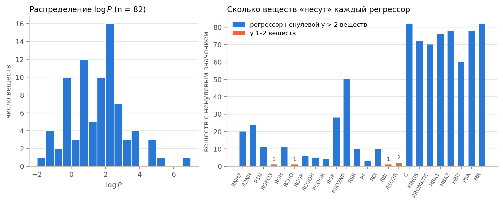
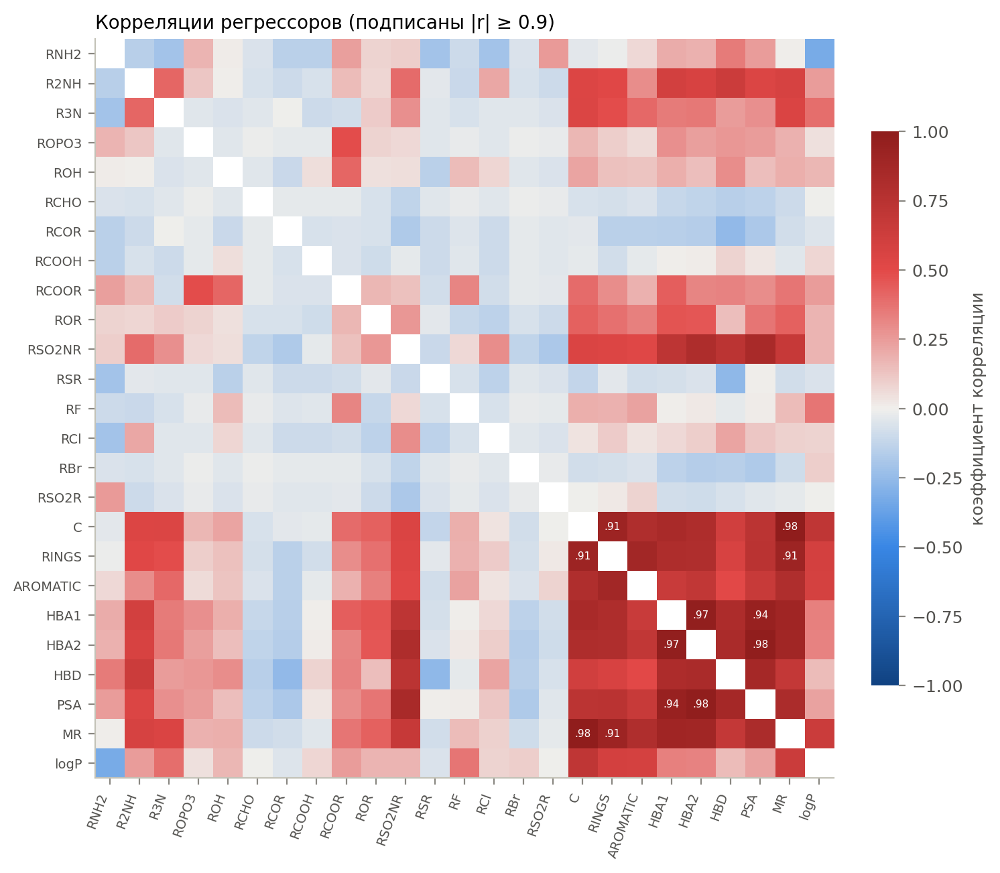
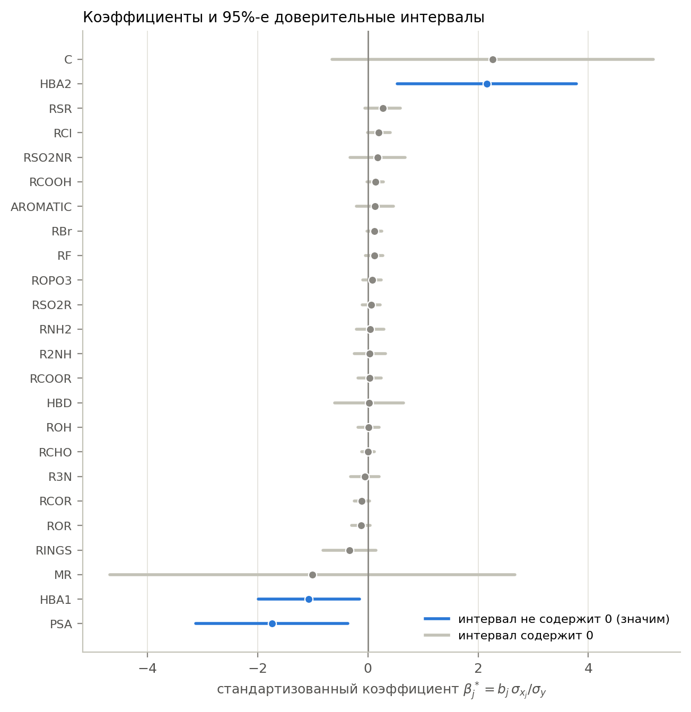
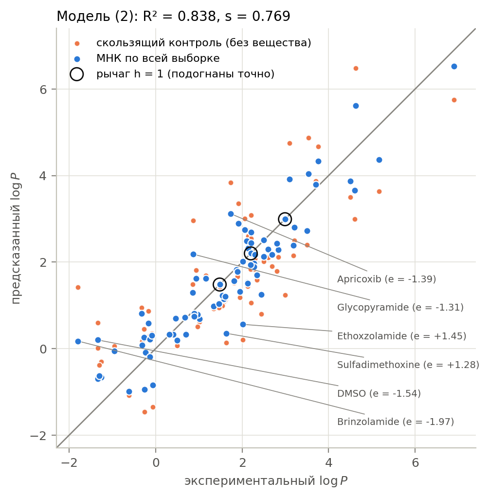
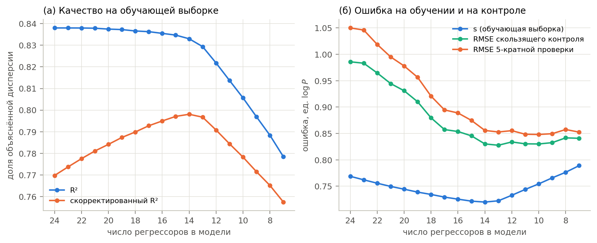
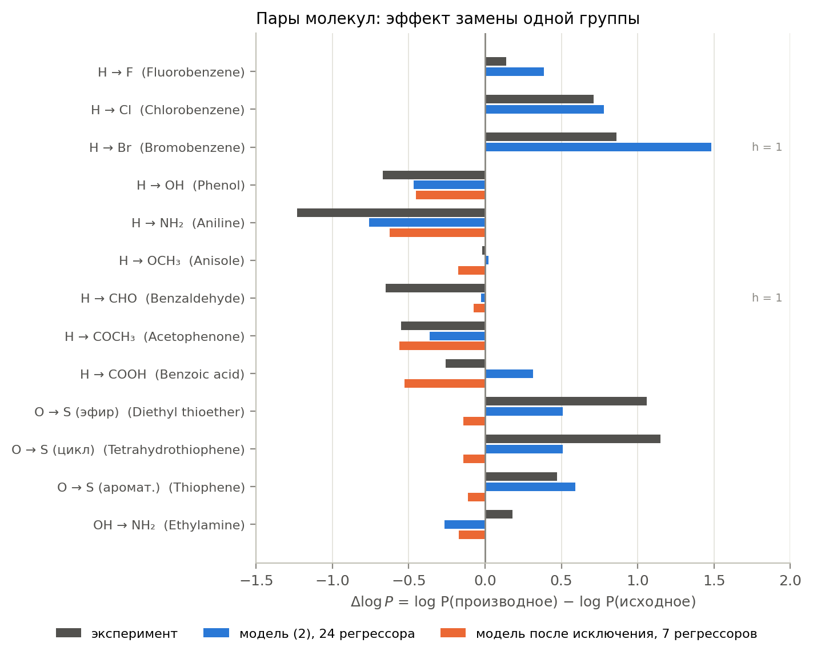
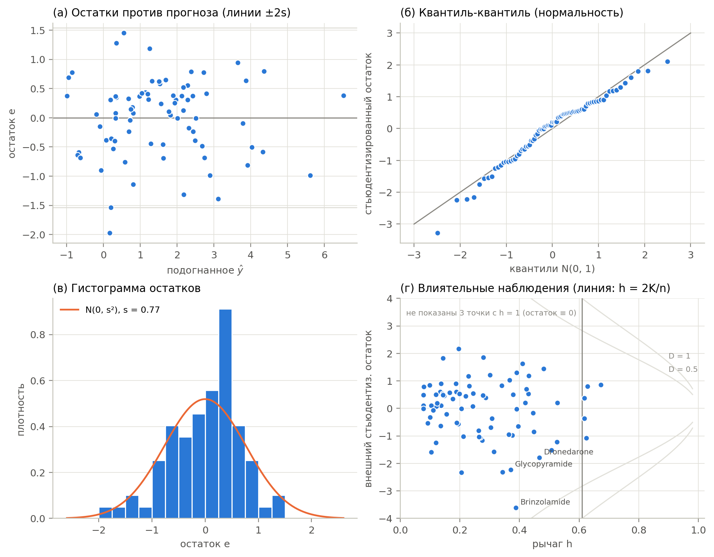

# Лабораторная работа 3. Расчёт зависимости коэффициента липофильности от структуры молекул с помощью линейной регрессии

**Отчёт.** Оценка модели (2) методички

```math
\log P = \beta_0 + \beta_1 x_1 + \ldots + \beta_{24} x_{24} + \varepsilon
```

методом наименьших квадратов по выборке `lipo.csv` (82 вещества, 24
структурных дескриптора), доверительные интервалы коэффициентов, проверка
условий применимости МНК и сравнение с работой [2].

Код: пакет [`lipo_ols`](src/lipo_ols) (Python, NumPy/SciPy/Matplotlib).
Все числа и рисунки ниже получены одной командой `python -m lipo_ols report`
(≈ 5 с) и воспроизводятся до последнего знака. Полные таблицы:
[results/tables.md](results/tables.md), остатки по веществам:
[results/residuals.csv](results/residuals.csv), все числа:
[results/summary.json](results/summary.json).

## Кратко о результатах

1. **Оценки (пункты 2–6).** $s^2 = 0.591$, $s = 0.769$, $R^2 = 0.838$,
   скорректированный $\bar R^2 = 0.770$. Регрессия в целом значима:
   $F = 12.28$ при критическом $F_{0.95}(24, 57) = 1.71$, $p = 9 \cdot 10^{-15}$.
   Но 95%-й доверительный интервал не содержит нуля только у **трёх** из 24
   коэффициентов: HBA1, HBA2 и PSA.
2. **Адекватность.** Как *описание* выборки модель хороша: она объясняет
   84 % дисперсии $\log P$. Как *инструмент прогноза* она заметно хуже. На
   веществах, не участвовавших в оценивании, ошибка равна 0.99 (скользящий
   контроль) и 1.05 (5-кратная перекрёстная проверка) против $s = 0.77$ на
   обучающей выборке. Модель переобучена: 25 коэффициентов на 82 наблюдения.
   Если исключить незначимые регрессоры, остаётся 7. Ошибка прогноза при этом
   *падает* до 0.85, а F-тест не отвергает гипотезу, что все 17 исключённых
   коэффициентов равны нулю ($p = 0.27$).
3. **Вклад регрессоров.** Наибольшие стандартизованные коэффициенты у
   числа атомов углерода C (+), HBA2 (+), площади полярной поверхности PSA (−),
   HBA1 (−) и мольной рефракции MR (−). Наименьшие — у RCHO, ROH, HBD, RCOOR,
   R2NH, RNH2. С теорией согласуется основное: липофильность растёт с
   неполярным углеродным скелетом и падает с полярностью, галогены повышают
   её в порядке F < Cl < Br, сера даёт больше, чем кислород. Знаки HBA2 (+)
   и MR (−) противоречат физике. Это следствие мультиколлинеарности
   (корреляции 0.97–0.99 с HBA1, PSA и C), а не реальный эффект.
4. **Условия МНК.** Предположения об *ошибках* выполняются: остатки
   нормальны (Шапиро–Уилк $p = 0.11$), гомоскедастичны (Бройш–Паган
   $p = 0.36$), нелинейность не обнаружена (RESET $p = 0.45$). Хуже с
   *матрицей регрессоров*: VIF до 1184, у трёх веществ рычаг $h = 1$
   (единственные носители ROPO3, RCHO, RBr), на коэффициент приходится всего
   3.3 наблюдения.
5. **Сравнение с [2].** Все напечатанные в статье статистики моделей MLR-1,
   MLR-2 и MLR-3 воспроизведены до последнего знака ($R^2$, $\bar R^2$, RMSE,
   $s$, $F$, $p$). Наша модель (2) — это MLR-3 из статьи. Значения
   $\log P$ в файле — **десятичные** логарифмы, как и в статье (у бензола
   $\log_{10} P = 2.13$), а не натуральные, как сказано в методичке.

---

## 1. Выборка (пункт 1)

### 1.1. Что в файле

82 вещества: 50 содержат сульфонамидную группу (сульфаниламиды,
противодиабетические сульфонилмочевины, диуретики, ингибиторы протеазы ВИЧ),
остальные — небольшие молекулы с теми же функциональными группами: бензол и
его производные, эфиры, тиоэфиры, кетоны, спирты. Отклик $\log P$ лежит в
пределах от −1.80 (бринзоламид) до 6.90 (типранавир), среднее 1.56,
стандартное отклонение 1.60. Пропусков нет.

**Основание логарифма.** Методичка называет $\log P$ натуральным
логарифмом, но числа в файле — десятичные: $\log P = 2.13$ у бензола и
2.84 у хлорбензола — это общепринятые $\log_{10} P$, натуральные были бы
в $\ln 10 \approx 2.3$ раза больше. Разности
$\log P(\mathrm{C_6H_5X}) - \log P(\mathrm{C_6H_6})$ в файле совпадают с
классическими константами гидрофобности Ганча (например, −0.67 для OH,
+0.71 для Cl). Работа [2] тоже использует десятичный логарифм. Для МНК
основание не важно: оно лишь масштабирует $y$ и все $b_k$. Важно оно для
интерпретации: ошибка 1.0 означает ошибку в $P$ в 10 раз, а не в $e$ раз.

**Таблица 1.** Регрессоры (табл. 1 методички): у скольких веществ регрессор отличен от нуля, диапазон, среднее и корреляция с $\log P$.

<!-- table:1 -->
| # | имя | смысл | ≠ 0 у | мин | макс | среднее | r(x, logP) |
|---|---|---|---|---:|---:|---:|---:|
| 1 | `RNH2` | первичные аминогруппы | 20 | 0 | 2 | 0.26 | -0.33 |
| 2 | `R2NH` | вторичные аминогруппы | 24 | 0 | 2 | 0.35 | +0.25 |
| 3 | `R3N` | третичные аминогруппы | 11 | 0 | 2 | 0.15 | +0.39 |
| 4 | `ROPO3` | фосфатные группы | 1 | 0 | 1 | 0.01 | +0.04 |
| 5 | `ROH` | гидроксильные группы | 11 | 0 | 1 | 0.13 | +0.17 |
| 6 | `RCHO` | альдегидные группы | 1 | 0 | 1 | 0.01 | -0.01 |
| 7 | `RCOR` | кетоновые группы | 6 | 0 | 2 | 0.09 | -0.05 |
| 8 | `RCOOH` | кислотные (карбоксильные) группы | 5 | 0 | 1 | 0.06 | +0.07 |
| 9 | `RCOOR` | сложноэфирные группы | 4 | 0 | 1 | 0.05 | +0.25 |
| 10 | `ROR` | простые эфирные группы | 28 | 0 | 3 | 0.46 | +0.18 |
| 11 | `RSO2NR` | сульфонамидные группы | 50 | 0 | 2 | 0.66 | +0.17 |
| 12 | `RSR` | тиоэфирные группы | 10 | 0 | 1 | 0.12 | -0.06 |
| 13 | `RF` | фторалкильные группы | 3 | 0 | 3 | 0.09 | +0.37 |
| 14 | `RCl` | хлоралкильные группы | 10 | 0 | 1 | 0.12 | +0.08 |
| 15 | `RBr` | бромалкильные группы | 1 | 0 | 1 | 0.01 | +0.10 |
| 16 | `RSO2R` | сульфоновые группы | 2 | 0 | 1 | 0.02 | -0.00 |
| 17 | `C` | атомы углерода | 82 | 2.00 | 40.00 | 12.32 | +0.71 |
| 18 | `RINGS` | циклы (любые) | 72 | 0 | 7 | 1.83 | +0.59 |
| 19 | `AROMATIC` | ароматические кольца | 70 | 0 | 4 | 1.51 | +0.59 |
| 20 | `HBA1` | возможные точки образования водородной связи | 76 | 0.00 | 18.00 | 4.98 | +0.33 |
| 21 | `HBA2` | атомы-акцепторы водородной связи | 78 | 0.00 | 14.00 | 4.84 | +0.32 |
| 22 | `HBD` | атомы-доноры водородной связи | 60 | 0 | 4 | 1.46 | +0.15 |
| 23 | `PSA` | площадь полярной поверхности, Ų | 78 | 0.00 | 198.03 | 81.43 | +0.23 |
| 24 | `MR` | мольная рефракция, см³/моль | 82 | 12.89 | 211.96 | 70.50 | +0.64 |
<!-- /table -->



*Рисунок 1. Слева — распределение $\log P$. Справа — у скольких веществ
регрессор отличен от нуля. ROPO3, RCHO и RBr встречаются по одному разу,
RSO2R — дважды.*

### 1.2. Особенности, важные для регрессии

- **Редкие регрессоры.** Фосфатная, альдегидная и бромалкильная группы есть
  только у одного вещества каждая: фосампренавир, бензальдегид, бромбензол.
  Коэффициент при таком индикаторе подбирается так, чтобы это единственное
  вещество было описано *точно*. Его остаток равен нулю при любом $\log P$,
  а сам коэффициент — просто «поправка на одну точку» (раздел 4.3).
- **Повторы строк $X$.** Три группы изомеров имеют *одинаковые* значения
  всех 24 регрессоров, но разные $\log P$ (табл. 4). Например, сульфадимидин
  (0.89) и сульфизомидин (−0.33) отличаются только взаимным
  расположением метильных групп и атомов азота в пиримидиновом кольце. Никакая модель вида
  $\hat y = f(x_1, \ldots, x_{24})$ не различит такие вещества. Разброс внутри
  групп — нижняя граница ошибки на этих дескрипторах (раздел 4.1).
- **Сильные корреляции регрессоров** (рис. 2): C и MR ($r = 0.985$), HBA2 и
  PSA (0.978), HBA1 и HBA2 (0.975), C и RINGS (0.91). Число атомов углерода и
  мольная рефракция по сути измеряют одно и то же — размер молекулы; HBA1,
  HBA2 и PSA — её полярность.
- **Неточности кодирования**, оставленные как есть, чтобы результаты были
  сравнимы с [2]. У тетрагидрофурана и тетрагидротиофена AROMATIC = 1, хотя
  это насыщенные циклы. Сульфоксиды (ДМСО, дифенилсульфоксид) закодированы как
  тиоэфиры (RSR = 1). У названий трёх веществ в файле концевые пробелы
  («Benzoic acid », «Ethanol », «Phenol »); при чтении они удаляются.

**Таблица 4.** Вещества с одинаковыми значениями всех 24 регрессоров.

<!-- table:4 -->
| вещества | logP | среднее | вклад в SS_pe |
|---|---:|---:|---:|
| Sulfadimethoxine, Sulfadoxine | 1.63, 0.70 | 1.165 | 0.4324 |
| Sulfadimidine, Sulfisomidine | 0.89, -0.33 | 0.280 | 0.7442 |
| Sulfamethoxydiazine, Sulfamethoxypyridazine, Sulfametopyrazine | 0.41, 0.32, 0.70 | 0.477 | 0.0789 |
<!-- /table -->



*Рисунок 2. Корреляции регрессоров между собой и с $\log P$ (последняя
строка). Блок C, RINGS, AROMATIC, HBA1, HBA2, HBD, PSA, MR почти целиком
тёмно-красный: эти дескрипторы растут вместе с размером молекулы.*

---

## 2. Методика (пункты 2–6)

В матричной записи лекции 3 $y = X\beta + \varepsilon$, где $X$ — матрица
$82 \times 25$ (первый столбец — единицы для $\beta_0$), $K = 25$.

| Величина | Формула (лекция 3) | Пункт |
|---|---|---|
| МНК-оценка | $X^T X\thinspace b = X^T y$, т. е. $b = (X^TX)^{-1}X^Ty = X^+ y$ | 2 |
| остатки | $e = y - Xb$ | 3 |
| дисперсия МНК-ошибки, SER | $s^2 = e^Te/(n - K)$, $s = \sqrt{s^2}$ | 4 |
| коэффициент детерминации | $R^2 = 1 - \langle e^2\rangle / (\langle y^2\rangle - \langle y\rangle^2)$ | 5 |
| стандартная ошибка $b_k$ | $SE(b_k) = \sqrt{s^2 \left((X^TX)^{-1}\right)_{kk}}$ | 6 |
| доверительный интервал | $\left[b_k - SE(b_k)\thinspace t^{n-K}_\alpha,\; b_k + SE(b_k)\thinspace t^{n-K}_\alpha\right]$ | 6 |

Доверительная вероятность $\alpha = 0.95$, число степеней свободы
$n - K = 57$. Квантиль $t^{57}_{0.95}$ найден двумя способами:

1. численным интегрированием плотности Стьюдента в форме лекции 3 (через
   $\Gamma$-функцию) и решением уравнения
   $\int_{-t}^{t}\rho^{57}_t(x)\thinspace dx = 0.95$;
2. функцией `scipy.stats.t.ppf`.

Оба дают $t^{57}_{0.95} = 2.002465$, расхождение $7 \cdot 10^{-14}$. Так же
получен критический $F_{0.95}(24, 57) = 1.7098$ по формуле плотности Фишера
из лекции.

**Численная проверка.** Нормальные уравнения, QR-разложение и
псевдообратная матрица дают одинаковые $b$ (расхождение
$2.3 \cdot 10^{-12}$), хотя число обусловленности $X^TX$ велико:
$5.9 \cdot 10^6$. Условия ортогональности выполняются:
$\max_k \lvert (X^Te)_k\rvert = 4 \cdot 10^{-11}$, в частности сумма
остатков равна нулю (в модели есть константа).

```python
data = load_lipo()              # 1. выборка
fit = fit_ols_data(data)        # 2. b из нормальных уравнений
fit.residuals                   # 3. e = y − Xb
fit.s2, fit.s                   # 4. s², s
fit.r2, fit.r2_adj              # 5. R², скорректированный R²
fit.conf_int(0.95)              # 6. интервалы b ± SE·t
```

---

## 3. Результаты (пункты 2–6)

### 3.1. Коэффициенты и доверительные интервалы

В столбце β* — стандартизованный коэффициент
$\beta^*_k = b_k\thinspace\sigma_{x_k}/\sigma_y$ (раздел 4.2), в столбце ΔR² —
насколько упадёт $R^2$, если убрать регрессор из модели.

**Таблица 2.** МНК-оценки $b_k$, стандартные ошибки, t-отношения, p-значения и 95%-е доверительные интервалы (пункты 2 и 6).

<!-- table:2 -->
| коэф. | b | SE(b) | t | p | 95%-й интервал | β* | ΔR² | ≠ 0? |
|---|---:|---:|---:|---:|---:|---:|---:|:---:|
| `const` | 0.0756 | 0.2537 | 0.30 | 0.767 | [-0.432; 0.584] |  |  | нет |
| `RNH2` | 0.1526 | 0.4261 | 0.36 | 0.722 | [-0.701; 1.006] | 0.04 | 0.0004 | нет |
| `R2NH` | 0.0970 | 0.3801 | 0.26 | 0.799 | [-0.664; 0.858] | 0.04 | 0.0002 | нет |
| `R3N` | -0.2417 | 0.5350 | -0.45 | 0.653 | [-1.313; 0.830] | -0.06 | 0.0006 | нет |
| `ROPO3` | 1.1465 | 1.2217 | 0.94 | 0.352 | [-1.300; 3.593] | 0.08 | 0.0025 | нет |
| `ROH` | 0.0536 | 0.4448 | 0.12 | 0.904 | [-0.837; 0.944] | 0.01 | 4.1e-5 | нет |
| `RCHO` | 0.0546 | 0.8166 | 0.07 | 0.947 | [-1.581; 1.690] | 3.8e-3 | 1.3e-5 | нет |
| `RCOR` | -0.5381 | 0.3483 | -1.55 | 0.128 | [-1.236; 0.159] | -0.11 | 0.0068 | нет |
| `RCOOH` | 0.9024 | 0.4882 | 1.85 | 0.070 | [-0.075; 1.880] | 0.14 | 0.0097 | нет |
| `RCOOR` | 0.2458 | 0.7943 | 0.31 | 0.758 | [-1.345; 1.836] | 0.03 | 0.0003 | нет |
| `ROR` | -0.2740 | 0.1853 | -1.48 | 0.145 | [-0.645; 0.097] | -0.13 | 0.0062 | нет |
| `RSO2NR` | 0.4951 | 0.6962 | 0.71 | 0.480 | [-0.899; 1.889] | 0.18 | 0.0014 | нет |
| `RSR` | 1.3211 | 0.7827 | 1.69 | 0.097 | [-0.246; 2.888] | 0.27 | 0.0081 | нет |
| `RF` | 0.3831 | 0.2597 | 1.48 | 0.146 | [-0.137; 0.903] | 0.11 | 0.0062 | нет |
| `RCl` | 0.9564 | 0.5042 | 1.90 | 0.063 | [-0.053; 1.966] | 0.20 | 0.0102 | нет |
| `RBr` | 1.7566 | 0.9593 | 1.83 | 0.072 | [-0.165; 3.678] | 0.12 | 0.0095 | нет |
| `RSO2R` | 0.6558 | 0.8486 | 0.77 | 0.443 | [-1.044; 2.355] | 0.06 | 0.0017 | нет |
| `C` | 0.4278 | 0.2754 | 1.55 | 0.126 | [-0.124; 0.979] | 2.26 | 0.0069 | нет |
| `RINGS` | -0.4145 | 0.2994 | -1.38 | 0.172 | [-1.014; 0.185] | -0.33 | 0.0054 | нет |
| `AROMATIC` | 0.2204 | 0.2867 | 0.77 | 0.445 | [-0.354; 0.794] | 0.13 | 0.0017 | нет |
| `HBA1` | -0.4321 | 0.1853 | -2.33 | 0.023 | [-0.803; -0.061] | -1.07 | 0.0155 | **да** |
| `HBA2` | 1.0234 | 0.3856 | 2.65 | 0.010 | [0.251; 1.796] | 2.16 | 0.0200 | **да** |
| `HBD` | 0.0374 | 0.4596 | 0.08 | 0.935 | [-0.883; 0.958] | 0.03 | 1.9e-5 | нет |
| `PSA` | -0.0533 | 0.0211 | -2.52 | 0.014 | [-0.096; -0.011] | -1.74 | 0.0181 | **да** |
| `MR` | -0.0356 | 0.0648 | -0.55 | 0.585 | [-0.165; 0.094] | -1.01 | 0.0009 | нет |
<!-- /table -->



*Рисунок 3. Стандартизованные коэффициенты и их 95%-е доверительные
интервалы. Синим — интервалы, не содержащие ноль. Самые широкие интервалы у
C и MR: из-за корреляции $r = 0.985$ модель не может разделить их вклады.*

### 3.2. Остатки, $s^2$, $s$, $R^2$

| Величина | Значение |
|---|---:|
| сумма квадратов остатков $SSR = e^Te$ | 33.685 |
| дисперсия МНК-ошибки $s^2 = SSR/57$ (пункт 4) | **0.5910** |
| стандартная ошибка регрессии $s$ (пункт 4) | **0.7687** |
| ML-оценка $\hat\sigma^2 = SSR/n = \frac{n-K}{n}s^2$ (смещённая) | 0.4108 |
| RMSE на обучающей выборке $\sqrt{SSR/n}$ | 0.641 |
| средний модуль остатка | 0.502 |
| коэффициент детерминации $R^2$ (пункт 5) | **0.8380** |
| скорректированный $\bar R^2 = 1 - (1 - R^2)\frac{n-1}{n-K}$ | 0.7698 |
| нецентрированный $R^2_{uc} = 1 - e^Te/y^Ty$ | 0.9173 |
| $F$ для гипотезы $\beta_1 = \ldots = \beta_{24} = 0$ | 12.28 ($p = 9.0 \cdot 10^{-15}$) |

Остатки всех 82 веществ (пункт 3) приведены в приложении (табл. П1) и в
файле [results/residuals.csv](results/residuals.csv). Наибольшие по модулю
остатки — у бринзоламида (−1.97), ДМСО (−1.54), этоксзоламида (+1.45),
априкоксиба (−1.39) и гликопирамида (−1.31). У бензальдегида, бромбензола и
фосампренавира остаток равен нулю *по построению* (рычаг $h = 1$, раздел 4.3).



*Рисунок 4. Синие точки — подгонка по всей выборке. Оранжевые — прогноз
того же вещества моделью, оценённой без него (скользящий контроль).
Расхождение синих и оранжевых точек показывает, насколько модель
«подстраивается» под конкретные вещества.*

---

## 4. Обсуждение (пункт 7)

### 4.1. Адекватно ли использование линейной модели?

**В целом регрессия значима.** F-тест лекции 3 с матрицей $R = [0 \mid I_{24}]$,
$r = 0$ даёт $F = 12.28 \gg F_{0.95}(24, 57) = 1.71$. Гипотеза «$\log P$ не
зависит от дескрипторов» отвергается с огромным запасом. $R^2 = 0.84$:
модель объясняет 84 % разброса $\log P$. Ошибка модели $s = 0.77$ вдвое
меньше разброса самого $\log P$ ($\sigma_y = 1.60$).

**Но на новых веществах модель работает заметно хуже.** $R^2$ на обучающей
выборке растёт с каждым добавленным регрессором, поэтому качество проверено
на веществах, не участвовавших в оценивании:

| Модель | k | $s$ (обучение) | RMSE скользящего контроля | $Q^2$ | RMSE 5-кратной проверки |
|---|---:|---:|---:|---:|---:|
| (2), все регрессоры | 24 | 0.769 | 0.986 | 0.62 | 1.050 ± 0.066 |
| после исключения незначимых | 7 | 0.789 | 0.841 | 0.72 | 0.853 ± 0.027 |
| только среднее $\bar y$ | 0 | 1.602 | — | 0 | — |

(5-кратная проверка — среднее и стандартное отклонение по 200 случайным
разбиениям; $Q^2 = 1 - PRESS/TSS$.)

Ошибка прогноза полной модели в 1.3–1.4 раза больше, чем ошибка на
обучающей выборке. Это признак переобучения: на 82 наблюдения приходится
25 коэффициентов (3.3 наблюдения на коэффициент вместо обычно
рекомендуемых хотя бы 10). Часть коэффициентов описывает не закономерность,
а шум конкретной выборки.

**Пошаговое исключение.** На каждом шаге убирался регрессор с наибольшим
p-значением t-теста, пока все оставшиеся не стали значимы на уровне 0.05
(табл. 6, рис. 5). Первыми ушли RCHO ($p = 0.95$), HBD, ROH, RNH2, R2NH и
MR. При исключении первых 10 регрессоров $R^2$ почти не меняется
(0.838 → 0.833), а ошибка прогноза падает с 1.05 до 0.86. Итоговая модель
с 7 регрессорами хуже описывает выборку ($R^2 = 0.778$), но лучше
предсказывает (RMSE 0.85). Совместный F-тест гипотезы «все 17 исключённых
коэффициентов равны нулю» в *полной* модели даёт $F = 1.23$ при
$F_{0.95}(17, 57) = 1.81$, $p = 0.27$: данные этой гипотезе не противоречат.

**Таблица 6.** Пошаговое исключение регрессоров: на каждом шаге убирается регрессор с наибольшим p-значением.

<!-- table:6 -->
| k | исключён | его p | R² | R²adj | s | RMSE LOO | RMSE 5-fold | BIC |
|---|---:|---:|---:|---:|---:|---:|---:|---:|
| 24 | — |  | 0.838 | 0.770 | 0.769 | 0.986 | 1.050 | 274.3 |
| 23 | `RCHO` | 0.947 | 0.838 | 0.774 | 0.762 | 0.983 | 1.046 | 269.9 |
| 22 | `HBD` | 0.943 | 0.838 | 0.778 | 0.756 | 0.965 | 1.019 | 265.5 |
| 21 | `ROH` | 0.845 | 0.838 | 0.781 | 0.750 | 0.945 | 0.995 | 261.2 |
| 20 | `RNH2` | 0.699 | 0.837 | 0.784 | 0.744 | 0.931 | 0.978 | 257.0 |
| 19 | `R2NH` | 0.775 | 0.837 | 0.787 | 0.739 | 0.910 | 0.957 | 252.7 |
| 18 | `MR` | 0.621 | 0.837 | 0.790 | 0.734 | 0.880 | 0.921 | 248.6 |
| 17 | `RSO2NR` | 0.727 | 0.836 | 0.793 | 0.729 | 0.857 | 0.895 | 244.4 |
| 16 | `RSO2R` | 0.582 | 0.835 | 0.795 | 0.725 | 0.854 | 0.889 | 240.3 |
| 15 | `RCOOR` | 0.574 | 0.835 | 0.797 | 0.722 | 0.845 | 0.875 | 236.3 |
| 14 | `AROMATIC` | 0.414 | 0.833 | 0.798 | 0.720 | 0.830 | 0.856 | 232.8 |
| 13 | `ROPO3` | 0.232 | 0.829 | 0.797 | 0.722 | 0.828 | 0.853 | 230.1 |
| 12 | `RF` | 0.087 | 0.822 | 0.791 | 0.733 | 0.834 | 0.855 | 229.3 |
| 11 | `RINGS` | 0.081 | 0.814 | 0.784 | 0.744 | 0.830 | 0.848 | 228.5 |
| 10 | `RBr` | 0.087 | 0.806 | 0.778 | 0.754 | 0.830 | 0.848 | 227.6 |
| 9 | `RCl` | 0.078 | 0.797 | 0.772 | 0.766 | 0.833 | 0.850 | 226.8 |
| 8 | `RCOOH` | 0.086 | 0.788 | 0.765 | 0.776 | 0.842 | 0.857 | 225.7 |
| 7 | `RSR` | 0.068 | 0.778 | 0.757 | 0.789 | 0.841 | 0.853 | 225.1 |
<!-- /table -->



*Рисунок 5. (а) $R^2$ монотонно падает при исключении регрессоров, а
скорректированный $\bar R^2$ максимален при 14 регрессорах. (б) Ошибка на
обучающей выборке ($s$) и на контроле. Контрольная ошибка падает, пока из
модели уходят лишние регрессоры, и выходит на плато около 0.85 при 7–14
регрессорах.*

**Таблица 7.** Модель после исключения: 7 регрессоров, все значимы на уровне 0.05.

<!-- table:7 -->
| коэф. | b | SE(b) | t | p | 95%-й интервал |
|---|---:|---:|---:|---:|---:|
| `const` | 0.1490 | 0.2075 | 0.72 | 0.475 | [-0.264; 0.562] |
| `R3N` | -0.7988 | 0.2899 | -2.76 | 0.007 | [-1.377; -0.221] |
| `RCOR` | -0.7747 | 0.2818 | -2.75 | 0.007 | [-1.336; -0.213] |
| `ROR` | -0.3353 | 0.1547 | -2.17 | 0.033 | [-0.644; -0.027] |
| `C` | 0.2859 | 0.0231 | 12.35 | < 0.001 | [0.240; 0.332] |
| `HBA1` | -0.4925 | 0.1108 | -4.44 | < 0.001 | [-0.713; -0.272] |
| `HBA2` | 0.6390 | 0.2493 | 2.56 | 0.012 | [0.142; 1.136] |
| `PSA` | -0.0297 | 0.0110 | -2.69 | 0.009 | [-0.052; -0.008] |
<!-- /table -->

**Нижняя граница ошибки.** Три группы изомеров с одинаковыми $X$ (табл. 4)
дают «чистую ошибку» $SS_{pe} = 1.256$ при 4 степенях свободы,
$\sigma_{pe} = 0.56$. Это ошибка, которую *никакая* функция от этих 24
дескрипторов не устранит: часть различий в липофильности зависит от
расположения групп, а дескрипторы его не видят. Тест на неадекватность
сравнивает остальную часть остатков с чистой ошибкой:
$F = (32.43/53)/(1.256/4) = 1.95$, $p = 0.27$. Систематическая
неадекватность не обнаружена, но мощность теста мала (всего 4 степени
свободы чистой ошибки).

**Вывод.** Линейная модель адекватна как описание: связь значима,
предпосылки об ошибках выполнены (раздел 4.3), систематической
нелинейности нет. Для прогноза $\log P$ новых веществ она пригодна с
оговорками. Ошибка около 1 единицы $\log P$ означает ошибку в коэффициенте
распределения $P$ примерно в 10 раз. Модель с 7 регрессорами
предсказывает лучше полной. Область применимости — вещества, похожие на
обучающие (сульфонамиды и простые органические молекулы). Для групп,
представленных одним-двумя веществами (Br, CHO, фосфат, сульфон),
коэффициенты фактически не оценены.

### 4.2. Какие регрессоры вносят наибольший и наименьший вклад?

Сами $b_k$ сравнивать нельзя: регрессоры измерены в разных единицах.
Коэффициент при PSA ($-0.053$ на Ų) мал лишь потому, что PSA меняется от 0
до 198 Ų. Поэтому использовались:

- **стандартизованный коэффициент**
  $\beta^*_k = b_k\thinspace\sigma_{x_k}/\sigma_y$: на сколько стандартных
  отклонений изменится $\log P$, если $x_k$ увеличить на одно своё стандартное
  отклонение при прочих равных (рис. 3, табл. 2);
- **вклад при исключении** $\Delta R^2_k = t_k^2(1 - R^2)/(n - K)$: какую долю
  дисперсии объясняет *только* этот регрессор сверх остальных;
- **парная корреляция** $r(x_k, \log P)$ (табл. 1);
- **пары молекул**: прогноз изменения $\log P$ при замене одной группы
  против эксперимента (табл. 8, рис. 6).

**Наибольший вклад** по $\lvert\beta^*\rvert$: C (+2.26), HBA2 (+2.16),
PSA (−1.74), HBA1 (−1.07), MR (−1.01). По $\Delta R^2$ впереди три значимых
регрессора: HBA2 (0.020), PSA (0.018), HBA1 (0.015). По парной корреляции
сильнее всего с $\log P$ связаны C ($r = 0.71$), MR (0.64), RINGS и
AROMATIC (0.59).

**Наименьший вклад:** RCHO ($\beta^* = 0.004$), ROH (0.011), HBD (0.025),
RCOOR (0.033), R2NH (0.036), RNH2 (0.044). Все они незначимы, и именно они
первыми ушли при пошаговом исключении.

**Согласуется ли это с теорией?** Липофильность определяется балансом двух
эффектов. Неполярная поверхность молекулы (углеводородный скелет) нарушает
структуру воды, и вещество выталкивается в октанол (гидрофобный эффект).
Полярные группы, образующие водородные связи с водой, удерживают вещество
в воде. Отсюда ожидания и проверка:

| Ожидание | Результат модели | Согласие |
|---|---|---|
| $\log P$ растёт с числом атомов C | $b_C = +0.43$ на атом, самая сильная парная корреляция ($r = 0.71$) | да |
| $\log P$ падает с полярной поверхностью | $b_{PSA} = -0.053$ на Ų, значим | да |
| водородные связи понижают $\log P$ | HBA1 −0.43 (значим), **HBA2 +1.02 (значим!)**, HBD ≈ 0 | частично |
| галогены повышают $\log P$, F < Cl < Br | RF +0.38, RCl +0.96, RBr +1.76; H→Cl: модель +0.78, эксперимент +0.71 | да |
| сера липофильнее кислорода | RSR +1.32; O→S в эфирах: модель +0.51, эксперимент +1.06 и +1.15 | качественно да |
| замыкание цикла уменьшает поверхность | RINGS −0.41 | да |
| поляризуемость (MR) повышает $\log P$ | $b_{MR} = -0.036$, хотя $r(MR, \log P) = +0.64$ | **нет** |
| карбоксильная группа понижает $\log P$ | RCOOH +0.90; H→COOH: модель +0.32, эксперимент −0.26 | **нет** |

Противоречия объясняются **мультиколлинеарностью**. HBA2 коррелирует с HBA1
($r = 0.975$) и с PSA (0.978), а MR — с C (0.985). Модель «делит» общий
эффект полярности (или размера) между почти одинаковыми регрессорами,
и отдельные коэффициенты получают компенсирующие друг друга знаки.
Осмысленна только их *сумма* для реального изменения структуры. Например,
добавление группы CH₂ увеличивает C на 1 и MR примерно на 4.65 см³/моль,
так что модель предсказывает
$\Delta\log P = 0.428 - 0.036 \cdot 4.65 \approx +0.26$. Знак верный, но
величина вдвое меньше классической гидрофобной константы метиленовой группы
(около 0.5 по Ганчу и Лео). В выборке большие молекулы одновременно и более
полярные (сульфонамидные лекарства), и разделить «размер» и «полярность»
по 82 веществам трудно. Положительный RCOOH — та же история: полярность
кислоты уже учтена через PSA, HBA и HBD, а индикатор играет роль поправки,
оценённой по 5 веществам.



*Рисунок 6. Изменение $\log P$ при замене одной группы: эксперимент (серый),
модель (2) (синий) и модель с 7 регрессорами (оранжевый). «h = 1» — одно из
веществ пары подогнано точно, и совпадение там ничего не доказывает.*

**Таблица 8.** Пары молекул: экспериментальная и предсказанная разности $\log P$; * — одно из веществ подогнано точно ($h = 1$).

<!-- table:8 -->
| замена | производное | Δ эксп. | Δ модель (2) | Δ модель 7 | слагаемые Δ модели (2) |
|---|---|---:|---:|---:|---|
| H → F | Fluorobenzene | 0.14 | 0.38 | 0.00 | RF +0.38, MR +0.00 |
| H → Cl | Chlorobenzene | 0.71 | 0.78 | 0.00 | RCl +0.96, MR -0.18 |
| H → Br | Bromobenzene | 0.86 | 1.48 * | 0.00 | RBr +1.76, MR -0.27 |
| H → OH | Phenol | -0.67 | -0.47 | -0.45 | PSA -1.08, HBA2 +1.02, HBA1 -0.43, MR -0.07, ROH +0.05, HBD +0.04 |
| H → NH₂ | Aniline | -1.23 | -0.76 | -0.63 | PSA -1.39, HBA2 +1.02, HBA1 -0.43, MR -0.16, RNH2 +0.15, HBD +0.04 |
| H → OCH₃ | Anisole | -0.02 | 0.02 | -0.18 | HBA2 +1.02, PSA -0.49, HBA1 -0.43, C +0.43, ROR -0.27, MR -0.23 |
| H → CHO | Benzaldehyde | -0.65 | -0.03 * | -0.07 | HBA2 +1.02, PSA -0.91, HBA1 -0.43, C +0.43, MR -0.19, RCHO +0.05 |
| H → COCH₃ | Acetophenone | -0.55 | -0.36 | -0.56 | HBA2 +1.02, PSA -0.91, C +0.86, RCOR -0.54, HBA1 -0.43, MR -0.36 |
| H → COOH | Benzoic acid | -0.26 | 0.32 | -0.53 | HBA2 +2.05, PSA -1.99, RCOOH +0.90, HBA1 -0.86, C +0.43, MR -0.25, HBD +0.04 |
| O → S (эфир) | Diethyl thioether | 1.06 | 0.51 | -0.14 | RSR +1.32, PSA -0.86, ROR +0.27, MR -0.23 |
| O → S (цикл) | Tetrahydrothiophene | 1.15 | 0.51 | -0.14 | RSR +1.32, PSA -0.86, ROR +0.27, MR -0.23 |
| O → S (аромат.) | Thiophene | 0.47 | 0.59 | -0.11 | RSR +1.32, PSA -0.80, ROR +0.27, MR -0.20 |
| OH → NH₂ | Ethylamine | 0.18 | -0.26 | -0.17 | PSA -0.31, RNH2 +0.15, MR -0.05, ROH -0.05 |
<!-- /table -->

Полная модель правильно передаёт знак и порядок величины эффектов OH, NH₂,
COCH₃, Cl, F и O → S и почти нулевой эффект OCH₃, но ошибается со знаком
для COOH и OH → NH₂.
Модель с 7 регрессорами хорошо предсказывает эффект кетонной группы
(−0.56 против −0.55). При этом она вообще «не знает» о галогенах: RF, RCl
и RBr были исключены как незначимые, и её прогноз для замены H → Cl равен
нулю. Статистическая незначимость здесь означает недостаток данных
(галогены есть у 3, 10 и 1 вещества), а не отсутствие эффекта. Химически
вклад галогенов хорошо известен.

### 4.3. Верны ли для выборки условия применимости МНК?

Лекция 3 перечисляет предположения классической линейной модели. Для
t-статистик и доверительных интервалов нужна ещё нормальность ошибок.

| Условие | Как проверено | Результат | Вывод |
|---|---|---|---|
| линейность | тест Рамсея (RESET): добавить в модель $\hat y^2$, $\hat y^3$ | $F = 0.80$, $p = 0.45$; на рис. 7а остатки без тренда | выполнено |
| строгая экзогенность $\langle\varepsilon \mid X\rangle = 0$ | прямо не проверяется: $X^Te = 0$ по построению МНК | изомеры с одинаковыми $X$ различаются по $\log P$ на величину до 1.2 | сомнительно (раздел ниже) |
| отсутствие мультиколлинеарности | ранг $X$, VIF, число обусловленности | ранг полный (25); VIF до 1184 (табл. 3); $\kappa = 275$ после нормировки столбцов при пороге 30 | формально выполнено, фактически **сильная** мультиколлинеарность |
| гомоскедастичность | тест Бройша–Пагана (Кёнкера) | $LM = 25.8$, $\chi^2_{24}$, $p = 0.36$ | выполнено |
| нет корреляции наблюдений | смысл данных; Дарбин–Уотсон | наблюдения — разные вещества, $DW = 2.08$ | выполнено (с оговоркой) |
| нормальность ошибок | Шапиро–Уилк, Харке–Бера, Q-Q (рис. 7б) | $W = 0.975$, $p = 0.11$; $JB = 4.40$, $p = 0.11$; асимметрия −0.53 | выполнено |
| нет точек, определяющих модель | рычаги, расстояние Кука (рис. 7г) | 3 точки с $h = 1$; max $D = 0.27 < 1$ (бринзоламид) | частично |
| $n \gg K$ | число наблюдений на коэффициент | $82/25 = 3.3$ | **нет** |

**Таблица 3.** Коэффициенты увеличения дисперсии $VIF_j = 1/(1 - R_j^2)$.

<!-- table:3 -->
| регрессор | VIF | регрессор | VIF |
|---|---:|---|---:|
| `MR` | 1183.8 | `RNH2` | 5.4 |
| `C` | 746.6 | `RCOOR` | 4.1 |
| `HBA2` | 232.7 | `RCl` | 3.8 |
| `PSA` | 167.3 | `ROH` | 3.2 |
| `HBA1` | 74.2 | `ROR` | 2.6 |
| `HBD` | 34.4 | `ROPO3` | 2.5 |
| `RSO2NR` | 21.7 | `RSO2R` | 2.4 |
| `RINGS` | 20.6 | `RF` | 2.1 |
| `AROMATIC` | 9.8 | `RCOOH` | 1.9 |
| `RSR` | 9.1 | `RCOR` | 1.7 |
| `R2NH` | 7.0 | `RBr` | 1.5 |
| `R3N` | 5.9 | `RCHO` | 1.1 |
<!-- /table -->



*Рисунок 7. (а) Остатки против прогноза: тренда и «воронки» нет. (б) Q-Q
график: точки на прямой, кроме бринзоламида внизу слева. (в) Гистограмма
остатков и плотность $N(0, s^2)$. (г) Рычаги и стьюдентизированные остатки,
серые кривые — уровни расстояния Кука.*

**Комментарии к пунктам таблицы.**

- **Мультиколлинеарность** не смещает оценки и не мешает прогнозу, но
  раздувает дисперсии отдельных коэффициентов. Дисперсия $b_{MR}$ в 1184
  раза больше, чем была бы при регрессоре, некоррелированном с остальными.
  Отсюда классический симптом: регрессия в целом высоко значима
  ($p = 10^{-14}$), а из 24 отдельных коэффициентов значимы только 3. Отсюда же
  неустойчивые и «нефизические» знаки (раздел 4.2).
- **Рычаги $h = 1$.** Фосампренавир, бензальдегид и бромбензол —
  единственные носители ROPO3, RCHO и RBr. Для них $h_{ii} = 1$: проектор
  $P = X(X^TX)^{-1}X^T$ переводит $y_i$ в $\hat y_i = y_i$, и остаток равен
  нулю при любом наблюдаемом значении. Эти три вещества ничего не говорят об
  остальных коэффициентах. Их коэффициенты (и их стандартные ошибки) опираются
  на одну точку и не имеют смысла как «вклад группы». Ещё 5 веществ имеют
  большой рычаг $h > 2K/n = 0.61$ (типранавир 0.67, делавирдин, целекоксиб,
  дапсон, дифенилсульфон). Но ни одно наблюдение не влияет на модель
  чрезмерно: максимальное расстояние Кука 0.27 у бринзоламида.
- **Строгая экзогенность** требует, чтобы ошибка не зависела от регрессоров.
  Её нарушают пропущенные переменные, коррелирующие с включёнными. Повторы
  строк $X$ показывают, что такие факторы есть: положение заместителей,
  внутримолекулярные водородные связи, ионизация. Кислоты и основания в воде
  частично ионизованы, и измеряемая величина ближе к $\log D$, чем к
  $\log P$. Если эти факторы связаны, например, с RSO2NR или PSA,
  коэффициенты при них смещены. Кроме того, экспериментальные значения
  собраны авторами [2] из разных источников и могут иметь разную точность.
- **Некоррелированность наблюдений.** Выборка не временной ряд, порядок
  строк алфавитный, поэтому $DW = 2.08$ ожидаем и мало что доказывает.
  Возможная корреляция другая: близкие по строению вещества (серии
  сульфаниламидов) могут иметь сходные ошибки, а выборка не случайна из
  какой-то генеральной совокупности, а подобрана авторами.

**Вывод.** Предположения об ошибках (линейность, гомоскедастичность,
нормальность, независимость) выполняются, поэтому t-интервалы и F-тесты
формально корректны. Слабое место — матрица регрессоров: сильная
мультиколлинеарность, точечно подогнанные индикаторы и малое число
наблюдений на коэффициент. Это не смещает $b$, но делает отдельные
коэффициенты ненадёжными и ухудшает прогноз (раздел 4.1).

### 4.4. Сходятся ли результаты с работой [2]?

Авторы [2] построили на тех же 82 веществах три вложенные модели: MLR-1
(регрессоры 1–19), MLR-2 (+ HBA1, HBA2, HBD) и MLR-3 (все 24). Наша модель (2)
совпадает с MLR-3.

**Таблица 5.** Наш расчёт / числа из статьи [2] для трёх вложенных моделей и ошибка прогноза на контроле.

<!-- table:5 -->
| модель | k | R² | R²adj | RMSE | s | F | p(F) | RMSE LOO | RMSE 5-fold |
|---|---:|---:|---:|---:|---:|---:|---:|---:|---:|
| MLR-1 | 19 | 0.794 / 0.79 | 0.731 / 0.73 | 0.722 / 0.72 | 0.831 / 0.83 | 12.60 / 12.6 | 1.02e-14 / 1.02e-14 | 0.962 | 0.999 |
| MLR-2 | 22 | 0.819 / 0.82 | 0.752 / 0.75 | 0.677 / 0.68 | 0.798 / 0.80 | 12.16 / 12.2 | 1.30e-14 / 1.30e-14 | 0.950 | 1.002 |
| MLR-3 | 24 | 0.838 / 0.84 | 0.770 / 0.77 | 0.641 / 0.64 | 0.769 / 0.77 | 12.28 / 12.3 | 9.00e-15 / 9.00e-15 | 0.986 | 1.050 |
<!-- /table -->

Все статистики, напечатанные в статье, совпадают с нашими при округлении до
того же числа знаков: $R^2$, $\bar R^2$, RMSE, $s$, $F$, p-значение. Это
верно для всех трёх моделей. Совпадают и коэффициенты детерминации парных
регрессий, приведённые в тексте статьи: C — 0.50, MR — 0.41, AROMATIC —
0.34, HBA1 — 0.11, HBA2 — 0.10. Таблица коэффициентов MLR-3 вынесена в
приложение к статье (Table S3), но сравнивать её нет необходимости. При
полном ранге $X$ МНК-решение единственно, а совпадение $R^2$, $s$ и $F$
до третьего знака на тех же данных означает ту же модель.

Дополнительно к статье:

- **Нужны ли HBA1, HBA2, HBD, PSA, MR?** F-тест гипотезы, что их
  коэффициенты в MLR-3 равны нулю, даёт $F = 3.07$ при
  $F_{0.95}(5, 57) = 2.38$, $p = 0.016$: вместе они значимы. Переход
  MLR-2 → MLR-3 (PSA и MR) значим на грани: $F = 3.29$ при критическом 3.16,
  $p = 0.044$.
- **Прогноз.** Авторы оценивали MLR-3 на 5 отложенных сульфонамидах
  (RMSE 0.20) и на 22 N-ацилсульфонамидах конкурса SAMPL7 (RMSE 0.58,
  лучший результат среди эмпирических методов). Наша перекрёстная проверка
  даёт заметно большую ошибку, 1.05. Противоречия здесь нет. Тестовые
  вещества статьи — сульфонамиды, похожие на обучающие, а при перекрёстной
  проверке в контрольную часть попадают и «уникальные» вещества (единственные
  носители групп, типранавир, бринзоламид), на которых модель экстраполирует.
  Это ещё раз показывает узкую область применимости модели.
- **Основание логарифма.** Статья использует десятичный $\log P$, как и
  файл с данными. Слова методички о натуральном логарифме не соответствуют
  числам.

---

## 5. Выводы

1. МНК-оценки модели (2) получены по нормальным уравнениям и проверены
   QR-разложением и псевдообратной матрицей. $s^2 = 0.591$, $s = 0.769$,
   $R^2 = 0.838$ ($\bar R^2 = 0.770$). Доверительные интервалы построены по
   t-статистике с квантилем $t^{57}_{0.95} = 2.0025$, найденным по формуле
   плотности Стьюдента из лекции.
2. Регрессия в целом высоко значима, но по отдельности значимы лишь HBA1,
   HBA2 и PSA. Причина — сильная мультиколлинеарность (C ≈ MR, HBA1 ≈ HBA2 ≈
   PSA) и три точечно подогнанных индикатора.
3. Модель адекватно описывает выборку, но переобучена. Ошибка прогноза
   (≈ 1.0) больше ошибки на обучении (0.77). Модель с 7 регрессорами
   предсказывает лучше (≈ 0.85) и не хуже согласуется с данными по F-тесту.
4. Главные факторы липофильности в модели — размер углеродного скелета (+)
   и полярность (−). Это согласуется с представлением о гидрофобном эффекте.
   Знаки галогенов, серы и замыкания цикла тоже верны. Знаки HBA2, MR и
   RCOOH — артефакты коллинеарности.
5. Предпосылки об ошибках (нормальность, гомоскедастичность, линейность)
   выполнены; условия на матрицу регрессоров — лишь формально.
6. Результаты полностью воспроизводят модели MLR-1, MLR-2 и MLR-3 работы [2].

## Список литературы

1. ГОСТ 32291-2013. Методы испытаний химической продукции, представляющей
   опасность для окружающей среды. Определение коэффициента распределения
   н-октанол/вода методом медленного перемешивания.
2. K. López, S. Pinheiro, W. J. Zamora. Multiple linear regression models
   for predicting the n-octanol/water partition coefficients in the SAMPL7
   blind challenge // J. Comput.-Aided Mol. Des. 2021. V. 35. P. 923–931.
   doi:10.1007/s10822-021-00409-2.
3. Е. П. Андреева, О. А. Раевский. Расчёт липофильности органических
   соединений на основе структурного сходства и молекулярных
   физико-химических дескрипторов // Хим.-фарм. журнал. 2009. Т. 43, № 5.
   С. 28–32.
4. C. Hansch, A. Leo. Substituent Constants for Correlation Analysis in
   Chemistry and Biology. New York: Wiley, 1979.
5. Лекция 3 «Классическая линейная модель регрессии», курс «Нейронные сети
   глубокого обучения».

---

## Приложение. МНК-остатки по веществам (пункт 3)

$e_i = y_i - \hat y_i$; $h$ — рычаг (диагональ матрицы-проектора).

**Таблица П1.** Экспериментальные значения, прогноз модели (2), остатки и рычаги.

<!-- table:П1 -->
| вещество | logP | ŷ | e | h |
|---|---:|---:|---:|---:|
| Acetamide | -1.26 | -0.67 | -0.595 | 0.38 |
| Acetanilide | 1.16 | 1.62 | -0.460 | 0.14 |
| Acetazolamide | -0.26 | -0.95 | 0.685 | 0.43 |
| Acetic acid | -0.17 | 0.59 | -0.756 | 0.27 |
| Acetohexamide | 2.44 | 1.25 | 1.186 | 0.28 |
| Acetone | -0.24 | -0.09 | -0.147 | 0.15 |
| Acetophenone | 1.58 | 1.14 | 0.436 | 0.13 |
| Amprenavir | 2.20 | 2.69 | -0.486 | 0.45 |
| Aniline | 0.90 | 0.75 | 0.154 | 0.12 |
| Anisole | 2.11 | 1.53 | 0.580 | 0.08 |
| Apricoxib | 1.73 | 3.12 | -1.386 | 0.34 |
| Benzaldehyde | 1.48 | 1.48 | 0 (h = 1) | 1.00 |
| Benzene | 2.13 | 1.51 | 0.623 | 0.10 |
| Benzoic acid | 1.87 | 1.82 | 0.047 | 0.24 |
| Benzophenone | 3.18 | 2.39 | 0.791 | 0.23 |
| Benzothiazole | 2.01 | 2.02 | -0.007 | 0.21 |
| Bosentan | 3.70 | 3.79 | -0.093 | 0.45 |
| Brinzolamide | -1.80 | 0.17 | -1.974 | 0.39 |
| Bromobenzene | 2.99 | 2.99 | 0 (h = 1) | 1.00 |
| Bumetanide | 2.60 | 2.29 | 0.307 | 0.38 |
| Butanedione | -1.34 | -0.70 | -0.641 | 0.53 |
| Carbutamide | 1.01 | 0.68 | 0.329 | 0.15 |
| Celecoxib | 3.53 | 4.03 | -0.504 | 0.62 |
| Chlorobenzene | 2.84 | 2.29 | 0.554 | 0.23 |
| Chlorpropamide | 2.27 | 1.96 | 0.306 | 0.22 |
| Chlorthalidone | 0.85 | 1.29 | -0.444 | 0.30 |
| Dapsone | 0.97 | 0.79 | 0.177 | 0.62 |
| Darunavir | 1.89 | 1.78 | 0.107 | 0.53 |
| Delavirdine | 2.80 | 2.43 | 0.375 | 0.63 |
| Diethyl ether | 0.89 | 0.81 | 0.076 | 0.14 |
| Diethyl thioether | 1.95 | 1.32 | 0.628 | 0.19 |
| Dioxane | -0.27 | 0.26 | -0.532 | 0.26 |
| Diphenyl sulfone | 2.14 | 2.32 | -0.177 | 0.62 |
| Diphenyl sulfoxide | 2.06 | 2.75 | -0.688 | 0.27 |
| DMSO | -1.34 | 0.20 | -1.539 | 0.21 |
| Dofetilide | 2.10 | 2.49 | -0.388 | 0.40 |
| Dronedarone | 4.63 | 5.62 | -0.985 | 0.47 |
| Ethanol | -0.31 | 0.08 | -0.387 | 0.19 |
| Ethanolamine | -1.31 | -0.62 | -0.686 | 0.26 |
| Ethoxzolamide | 2.01 | 0.56 | 1.450 | 0.20 |
| Ethylamine | -0.13 | -0.19 | 0.057 | 0.12 |
| Fluorobenzene | 2.27 | 1.89 | 0.378 | 0.14 |
| Fosamprenavir | 2.20 | 2.20 | 0 (h = 1) | 1.00 |
| Furan | 1.34 | 0.98 | 0.364 | 0.12 |
| Glimepiride | 3.50 | 2.73 | 0.775 | 0.30 |
| Glipizide | 1.91 | 2.90 | -0.987 | 0.31 |
| Gliquidone | 4.50 | 3.87 | 0.632 | 0.37 |
| Glyburide | 3.75 | 4.34 | -0.582 | 0.36 |
| Glycopyramide | 0.87 | 2.18 | -1.314 | 0.37 |
| Hydrochlorothiazide | -0.07 | -0.85 | 0.777 | 0.39 |
| Ibutilide | 4.60 | 3.65 | 0.945 | 0.41 |
| Indapamide | 2.20 | 2.44 | -0.239 | 0.31 |
| Mefruside | 1.54 | 1.23 | 0.314 | 0.43 |
| Metolazone | 2.50 | 2.13 | 0.371 | 0.24 |
| Oxetane | -0.14 | 0.22 | -0.358 | 0.19 |
| Paritaprevir | 3.10 | 3.91 | -0.811 | 0.51 |
| Phenol | 1.46 | 1.04 | 0.420 | 0.19 |
| Probenecid | 3.21 | 2.80 | 0.413 | 0.42 |
| Simeprevir | 5.16 | 4.37 | 0.794 | 0.48 |
| Sulfacetamide | -0.96 | -0.06 | -0.900 | 0.12 |
| Sulfadiazine | -0.09 | 0.31 | -0.399 | 0.09 |
| Sulfadimethoxine | 1.63 | 0.35 | 1.277 | 0.14 |
| Sulfadimidine | 0.89 | 0.81 | 0.079 | 0.10 |
| Sulfadoxine | 0.70 | 0.35 | 0.347 | 0.14 |
| Sulfamethoxazole | 0.89 | 0.75 | 0.143 | 0.12 |
| Sulfamethoxydiazine | 0.41 | 0.33 | 0.079 | 0.08 |
| Sulfamethoxypyridazine | 0.32 | 0.33 | -0.011 | 0.08 |
| Sulfametopyrazine | 0.70 | 0.33 | 0.369 | 0.08 |
| Sulfamoxole | 0.68 | 0.72 | -0.044 | 0.11 |
| Sulfanilamide | -0.62 | -0.99 | 0.371 | 0.20 |
| Sulfasalazine | 2.50 | 2.51 | -0.012 | 0.39 |
| Sulfisomidine | -0.33 | 0.81 | -1.141 | 0.10 |
| Sumatriptan | 0.93 | 1.63 | -0.695 | 0.21 |
| Tamsulosin | 2.30 | 2.18 | 0.124 | 0.42 |
| Tetrahydrothiophene | 1.61 | 1.20 | 0.407 | 0.17 |
| THF | 0.46 | 0.70 | -0.235 | 0.10 |
| Thiophene | 1.81 | 1.57 | 0.243 | 0.18 |
| Tipranavir | 6.90 | 6.52 | 0.378 | 0.67 |
| Tolazamide | 2.69 | 2.17 | 0.522 | 0.34 |
| Tolbutamide | 2.34 | 1.69 | 0.646 | 0.14 |
| Xipamide | 2.19 | 1.93 | 0.256 | 0.29 |
| Zonisamide | 0.50 | 0.19 | 0.309 | 0.28 |
<!-- /table -->
