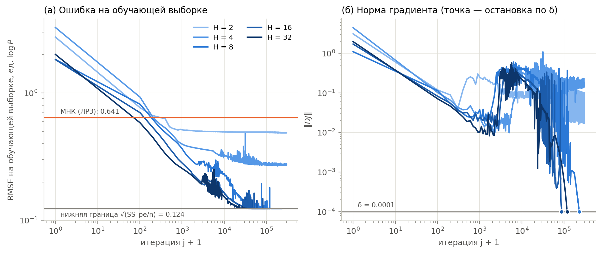
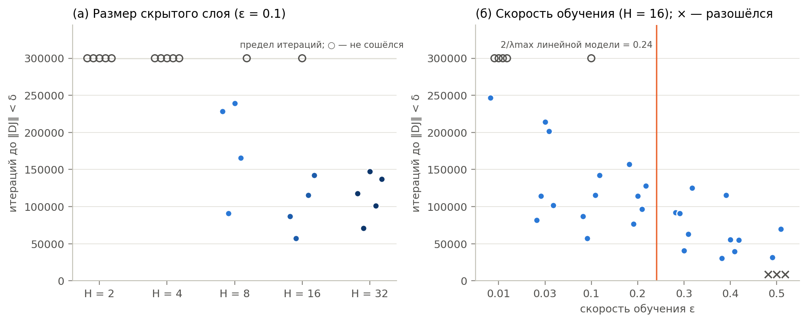
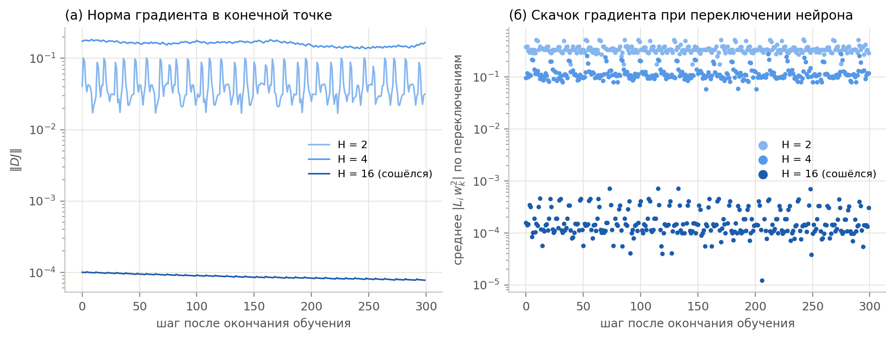
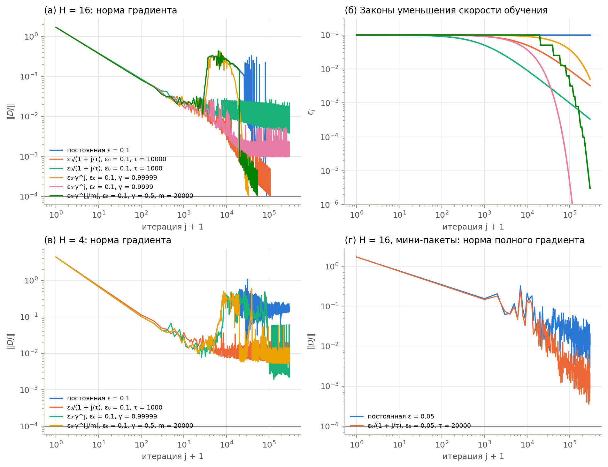
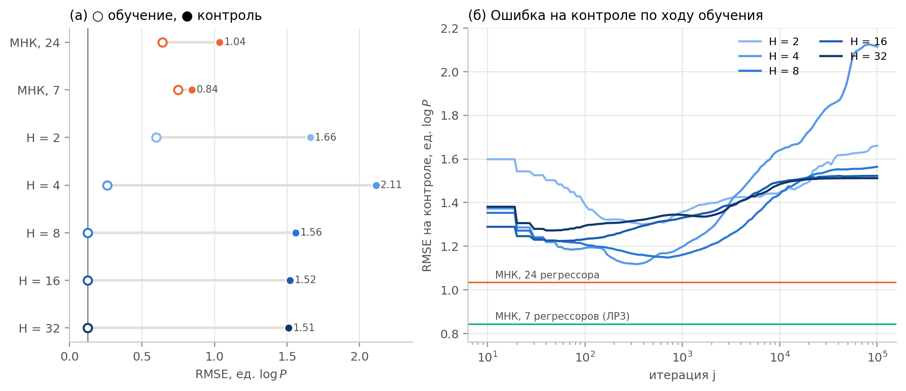
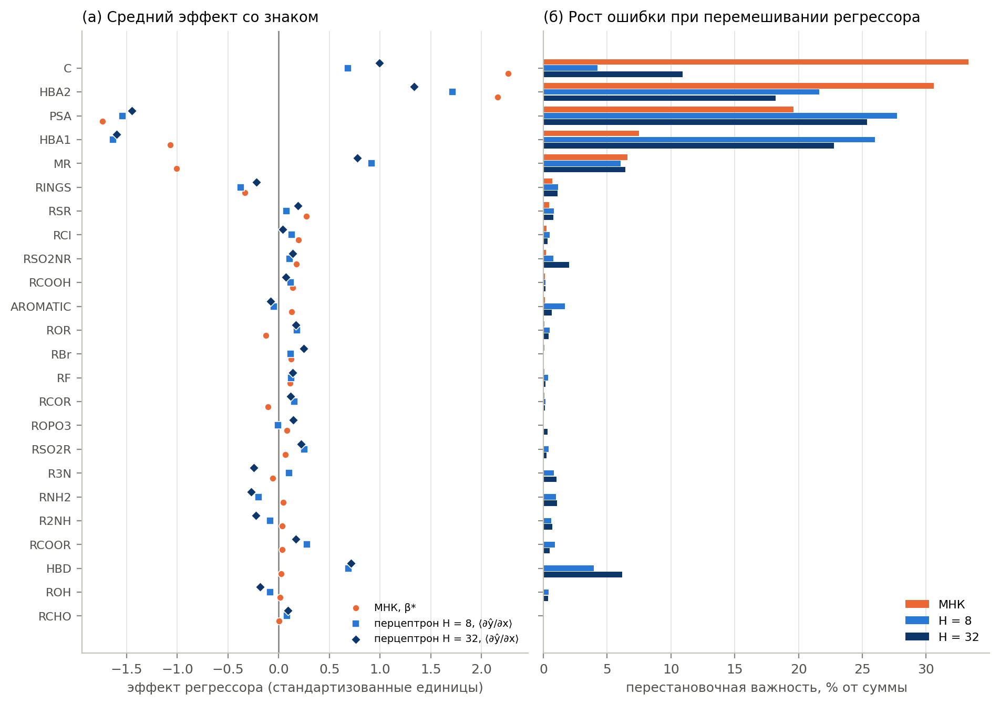
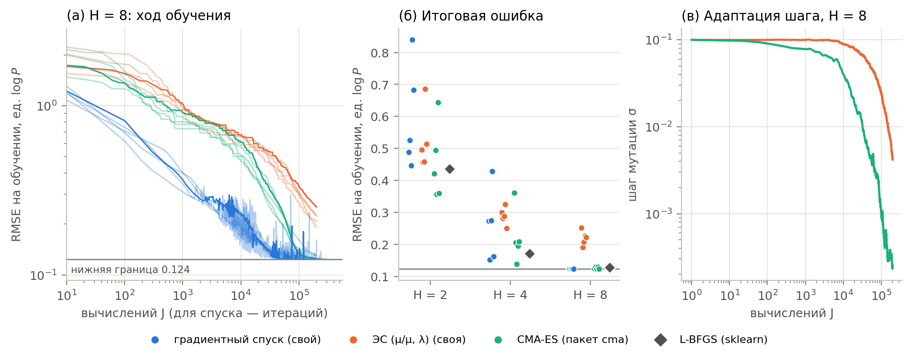

# Лабораторная работа 4. Расчёт зависимости коэффициента липофильности от структуры молекул с помощью двухслойного перцептрона

**Отчёт.** Двухслойный перцептрон (2) методички

```math
\log P = b^2_1 + (w^2)^T \mathrm{relu}(w^1 x + b^1)
```

с 2, 4, 8, 16 и 32 нейронами скрытого слоя обучается градиентным спуском по
выборке `lipo.csv` (82 вещества, 24 структурных дескриптора). Исследуются
сходимость, уменьшение скорости обучения, сравнение с `MLPRegressor` из
scikit-learn, обобщающая способность и вклад регрессоров. Итог сравнивается
с линейной регрессией из [ЛР3](../lab3/REPORT.md). По дополнению к заданию
перцептрон обучен также эволюционными алгоритмами — своим и пакетным, — и
свой способ сопоставлен с пакетами по точности, скорости и качеству
прогноза (разделы 9–10).

Код: пакет [`lipo_mlp`](src/lipo_mlp) (Python, NumPy; пакеты scikit-learn и
cma — только для сравнения). Все числа и рисунки получены командой
`python -m lipo_mlp report` (≈ 10 мин на 8 ядрах; 215 запусков обучения по
до $3 \cdot 10^5$ итераций или $2 \cdot 10^5$ вычислений функции потерь) и
воспроизводятся до последнего знака (кроме времени работы). Полные
таблицы: [results/tables.md](results/tables.md), все числа:
[results/summary.json](results/summary.json).

## Кратко о результатах

1. **Сколько итераций и сошёлся ли спуск.** При $\varepsilon = 0.1$,
   $\delta = 10^{-4}$ сети с $H = 8, 16, 32$ сошлись в 13 из 15 запусков за
   $5.7 \cdot 10^4$–$2.4 \cdot 10^5$ итераций. Медиана — около $10^5$–$2 \cdot 10^5$,
   разброс между начальными весами в 2–4 раза. Они пришли в **глобальный
   минимум** ошибки на обучающей выборке: RMSE = 0.1237. Это наименьшее
   возможное значение: сеть точно описывает все вещества, кроме изомеров с
   одинаковыми дескрипторами. Сети с $H = 2$ и $H = 4$ не сошлись ни разу.
   Их минимум лежит на изломе ReLU, где градиент не обращается в ноль,
   поэтому критерий $\lVert DJ \rVert < \delta$ недостижим при любой
   скорости обучения.
2. **Уменьшение скорости обучения.** Медленное убывание (экспоненциальное с
   $\gamma = 0.99999$) ускорило и сделало надёжнее сходимость $H = 16$:
   5 из 5 запусков, медиана $4.7 \cdot 10^4$ итераций против 4 из 5 и
   $1.0 \cdot 10^5$ при постоянном шаге. Слишком быстрое убывание (сумма шагов
   конечна или почти конечна) останавливает спуск на полпути. Расходимость
   при слишком большом $\varepsilon_0 = 0.5$ уменьшение шага не спасает: она
   развивается за 5–6 итераций. При обучении по мини-пакетам уменьшение шага
   необходимо: с постоянным шагом норма градиента застревает на уровне шума
   $\approx 2 \cdot 10^{-2}$.
3. **scikit-learn.** При одинаковых начальных весах `MLPRegressor` с
   полнопакетным SGD проходит ту же траекторию, что и наш спуск. После 2000
   итераций веса совпадают побитово. Это независимая проверка ручных формул
   градиента. Встроенный критерий остановки библиотеки срабатывает уже через
   ~300 итераций, далеко от минимума. L-BFGS доходит до минимума за 300–1040
   итераций.
4. **Адекватность.** Как описание обучающей выборки перцептрон «слишком
   хорош»: $R^2 = 0.994$ при 209–833 параметрах на 82 наблюдения. Он
   запоминает выборку. На контроле (5-кратная перекрёстная проверка) его
   ошибка 1.5–2.1 — хуже линейной регрессии (1.04) и даже
   хуже прогноза средним (1.59) при $H = 2, 4$. Ранняя остановка и
   L2-регуляризация в лучшем случае доводят ошибку до уровня линейной
   модели (≈ 1.0), но не лучше модели из 7 регрессоров (0.85). **Для этой
   выборки двухслойный перцептрон не адекватен**: данных слишком мало, а
   нелинейность не подтверждается.
5. **Вклад регрессоров.** Главные те же, что у линейной модели: площадь
   полярной поверхности PSA (−), HBA1 (−), HBA2 (+), число атомов углерода C
   (+), затем MR и HBD. Наименьший — у редких индикаторов (RCHO, RBr, ROPO3,
   RCOOH, RCOR, RF). Ранговая корреляция перестановочной важности с
   $\lvert\beta^*\rvert$ линейной модели 0.54–0.55.
6. **Сравнение с линейной регрессией.** Линейная регрессия — частный случай
   перцептрона без скрытого слоя (лекция 4). Перцептрон лучше описывает
   обучающую выборку (RMSE 0.12 против 0.64), но хуже предсказывает новые
   вещества, требует $10^5$ итераций вместо одной системы уравнений, его
   решение зависит от начальных весов, и для него нет доверительных
   интервалов. На этих данных предпочтительна линейная модель.
7. **Эволюционный алгоритм** (дополнение). Обучение без градиента — по
   значениям функции потерь — работает. CMA-ES из пакета `cma` при $H = 8$
   доходит до той же нижней границы (RMSE 0.127), а при $H = 2, 4$ находит
   минимумы лучше градиентного спуска. Своя эволюционная стратегия
   $(\mu/\mu, \lambda)$ в 10 раз быстрее на одно вычисление, но за тот же
   бюджет обучает сеть хуже (0.22 при $H = 8$). Обоим нужно в сотни раз
   больше вычислений, чем L-BFGS, а CMA-ES находит сети с большими весами,
   которые хуже всех предсказывают новые вещества (RMSE контроля 3.2).
8. **Свой способ или пакет** (дополнение). Один и тот же алгоритм (градиентный
   спуск) свой код и scikit-learn выполняют с одинаковым результатом, свой —
   в 1.8 раза быстрее и с нужным заданию критерием остановки. Но пакеты
   дают *лучшие алгоритмы*: L-BFGS доходит до минимума в 200 раз быстрее
   нашего спуска, CMA-ES обучает лучше нашей эволюционной стратегии. Свой
   код лучше для изучения и контроля, пакеты — для практики.

---

## 1. Модель и данные (пункты 1–2)

**Модель.** Для вектора дескрипторов $x \in \mathbb R^{24}$ скрытый слой
вычисляет $z = w^1 x + b^1$ ($w^1$ — матрица $H \times 24$) и
$\mathrm{relu}(z) = \max(0, z)$ поэлементно, выходной нейрон —
$\hat y = b^2_1 + (w^2)^T \mathrm{relu}(z)$. Всего $H(d + 2) + 1$ параметров:

| $H$ | 2 | 4 | 8 | 16 | 32 |
|---|---:|---:|---:|---:|---:|
| параметров | 53 | 105 | 209 | 417 | 833 |
| параметров на одно наблюдение | 0.65 | 1.3 | 2.5 | 5.1 | 10.2 |

Уже при $H = 4$ параметров больше, чем наблюдений (82). У линейной модели
ЛР3 их было 25.

**Подготовка данных.** Особенности выборки разобраны в отчёте ЛР3
(раздел 1). Для перцептрона важны две:

- **Разные масштабы.** Индикаторы групп принимают значения 0–3, число
  атомов углерода — до 40, площадь PSA — до 198 Ų. При одной скорости
  обучения для всех весов шаг, подходящий для PSA, был бы ничтожен для
  индикаторов, и наоборот. Поэтому каждый регрессор и сам $\log P$
  стандартизуются (среднее 0, дисперсия 1). Прогнозы переводятся обратно, и
  все ошибки ниже указаны в единицах $\log P$. При перекрёстной проверке
  параметры стандартизации оцениваются только по обучающей части.
- **Повторы.** Три группы изомеров (7 веществ) имеют одинаковые
  дескрипторы, но разные $\log P$. Любая функция $f(x)$ выдаёт для них одно
  значение, лучшее из возможных — среднее по группе. Поэтому ошибка на
  обучающей выборке не может быть меньше
  $\sqrt{SS_{pe}/n} = \sqrt{1.2555/82} = 0.1237$ («чистая ошибка» ЛР3).

---

## 2. Алгоритм и выбор $\varepsilon$, $\delta$ (пункты 3–4)

**Функция потерь и градиент.** Минимизируется среднеквадратичная ошибка

```math
J = \frac{1}{2n}\sum_{i=1}^{n} L_i^2, \qquad L_i = y_i - b^2_1 - (w^2)^T\mathrm{relu}(w^1 x_i + b^1).
```

Множитель $\frac{1}{2n}$ вместо суммы из лекции 4 не меняет точку
минимума, но делает градиент независимым от числа веществ. Тогда одна и
та же $\varepsilon$ годится и для всей выборки, и для её частей при
перекрёстной проверке. Кроме того, это в точности функция потерь
`MLPRegressor`. Градиент — по формулам лекции 4 с $V_i = w^2 \circ H(w^1 x_i + b^1)$,
где $H$ — функция Хевисайда (производная ReLU):

```math
D_{b^2}J = -\frac1n\sum_i L_i,\quad
D_{w^2}J = -\frac1n\sum_i \mathrm{relu}(w^1x_i + b^1)\,L_i,\quad
D_{b^1}J = -\frac1n\sum_i V_i L_i,\quad
D_{w^1}J = -\frac1n\sum_i V_i L_i \otimes x_i.
```

**Алгоритм** — ровно шаги 1–3.5 лекции. Начальные веса задаются
случайно, по Хе: $w^1_{jk} \sim N(0, 2/d)$, $w^2_j \sim N(0, 1/H)$, смещения
нулевые. Нулевые веса не годятся: все нейроны были бы одинаковы и такими бы
и остались. Для каждой конфигурации — 5 запусков с разными начальными весами
(зёрна 0–4). Остановка: $\lVert DJ[j]\rVert < \delta$ (евклидова норма
вектора всех производных) или предел в $3 \cdot 10^5$ итераций.

**Проверка градиента.** (1) Сравнение с центральными конечными разностями:
расхождение не больше $10^{-10}$ для $H = 1 \ldots 32$. (2) Траектория
`MLPRegressor` с теми же начальными весами совпадает с нашей побитово
(раздел 5).

**Выбор $\varepsilon$.** Ориентир даёт линейная модель на тех же
стандартизованных признаках. Её гессиан $X^TX/n$ имеет собственные числа от
$\lambda_{min} = 4.9 \cdot 10^{-4}$ до $\lambda_{max} = 8.31$. Градиентный
спуск устойчив при $\varepsilon < 2/\lambda_{max} = 0.24$. Для перцептрона
граница оказалась немного выше: при $\varepsilon \le 0.4$ все запуски
устойчивы, при $\varepsilon = 0.5$ три из пяти разошлись за 5–6 итераций
(табл. 2, рис. 2б). Выбрано $\varepsilon = 0.1$ — с запасом в 2.4 раза до
границы для линейной модели.

**Таблица 2.** Постоянная скорость обучения, $H = 16$, 5 запусков на значение.

<!-- table:2 -->
| ε | сошлось | итераций: медиана (мин–макс) | RMSE обучения |
|---|---:|---:|---:|
| 0.01 | 1 из 5 | 246 555 | 0.125 |
| 0.03 | 5 из 5 | 114 367 (82 051–214 020) | 0.124 |
| 0.1 | 4 из 5 | 101 229 (57 403–142 469) | 0.124 |
| 0.2 | 5 из 5 | 114 330 (76 379–157 118) | 0.124 |
| 0.3 | 5 из 5 | 90 959 (40 934–125 209) | 0.124 |
| 0.4 | 5 из 5 | 54 993 (30 326–115 439) | 0.124 |
| 0.5 | 2 из 5, разошлись 3 | 50 462 (31 321–69 603) | 0.124 |
<!-- /table -->

**Выбор $\delta$.** В начале обучения $\lVert DJ\rVert \approx 1$–$4$.
$\delta = 10^{-4}$ означает уменьшение градиента на 4–5 порядков. При этом
потери уже не меняются в первых 4–5 значащих цифрах.

**Почему итераций так много.** Отношение $\lambda_{max}/\lambda_{min}$
гессиана линейной части равно $1.7 \cdot 10^4$. Это мультиколлинеарность
из ЛР3 (C ≈ MR, HBA1 ≈ HBA2 ≈ PSA), только в другом обличье. При
устойчивом шаге $\varepsilon < 2/\lambda_{max}$ ошибка вдоль самого
«пологого» направления убывает в $(1 - \varepsilon\lambda_{min})$ раз за
итерацию. Чтобы уменьшить её в $e$ раз, нужно
$1/(\varepsilon\lambda_{min}) \approx 2 \cdot 10^4$ итераций. Градиентный
спуск с одним шагом для всех направлений плохо подходит для таких задач.

---

## 3. Сходимость при разном числе нейронов (пункт 5, первый вопрос)

**Таблица 1.** Обучение при $\varepsilon = 0.1$, $\delta = 10^{-4}$, 5 запусков на размер. RMSE — среднее (мин–макс) по запускам; $R^2 = 1 - RMSE^2/\sigma_y^2$; $\lVert DJ\rVert$ — медиана в момент остановки.

<!-- table:1 -->
| H | параметров | сошлось | итераций: медиана (мин–макс) | RMSE обучения | R² | ‖DJ‖ в конце |
|---|---:|---:|---:|---:|---:|---:|
| 2 | 53 | 0 из 5 | — | 0.597 (0.447–0.840) | 0.851 | 5.5e-02 |
| 4 | 105 | 0 из 5 | — | 0.258 (0.153–0.429) | 0.970 | 1.5e-01 |
| 8 | 209 | 4 из 5 | 196 919 (90 780–239 364) | 0.124 (0.124–0.124) | 0.994 | 1.0e-04 |
| 16 | 417 | 4 из 5 | 101 229 (57 403–142 469) | 0.124 (0.124–0.124) | 0.994 | 1.0e-04 |
| 32 | 833 | 5 из 5 | 117 951 (70 766–147 590) | 0.124 (0.124–0.124) | 0.994 | 1.0e-04 |
<!-- /table -->



*Рисунок 1. Обучение с $\varepsilon = 0.1$ (зерно 0). (а) Ошибка на
обучающей выборке. Оранжевая линия — линейная регрессия ЛР3, серая —
нижняя граница 0.1237. (б) Норма градиента и порог $\delta$; точка —
момент остановки.*



*Рисунок 2. Число итераций до $\lVert DJ\rVert < \delta$ в каждом запуске.
(а) По размеру скрытого слоя. (б) По скорости обучения для $H = 16$.
○ — не сошёлся за $3 \cdot 10^5$ итераций, × — разошёлся.*

**$H \ge 8$: сошёлся в глобальный минимум.** Из 15 запусков 13 остановились
по критерию за 57 403–239 364 итерации (табл. 1). В двух оставшихся (по
одному для $H = 8$ и $H = 16$) ошибка тоже вышла на 0.124, но норма
градиента к $3 \cdot 10^5$ итераций ещё не опустилась до $10^{-4}$. Во всех
этих запусках RMSE на обучающей выборке равна 0.1237, то есть нижней
границе из раздела 1. Значит, найден **глобальный** минимум $J$: сеть
описывает 75 веществ точно, а для трёх групп изомеров выдаёт средние по
группе. Кривые на рис. 1 проходят три стадии:

1. быстрое убывание ошибки за первые $10^2$–$10^3$ итераций;
2. неустойчивый участок ($10^3$–$10^4$): норма градиента *растёт* на 1–2
   порядка и скачет. В острых направлениях шаг оказывается на грани
   устойчивости, и ошибка временами подскакивает (пики на рис. 1а);
3. медленное «доползание» вдоль пологих направлений, которое и занимает
   основное время.

Число итераций зависит от начальных весов в 2–4 раза. Перцептрон —
невыпуклая задача, и из разных начальных точек спуск идёт к разным
(хотя одинаково хорошим) минимумам. Большее $H$ не ускоряет сходимость
заметно: медианы $2.0 \cdot 10^5$, $1.0 \cdot 10^5$ и $1.2 \cdot 10^5$
итераций для $H = 8, 16, 32$.

**$H = 2$ и $H = 4$: не сошёлся.** Ни один запуск не достиг
$\lVert DJ \rVert < \delta$ за $3 \cdot 10^5$ итераций. Ошибка при этом
давно перестала уменьшаться (RMSE 0.45–0.84 при $H = 2$ и 0.15–0.43 при
$H = 4$, в зависимости от начальных весов), а норма градиента колеблется
около $0.02$–$0.2$ и не убывает (рис. 1б). Причина — **излом ReLU**.
Узкая сеть не может пройти через все точки, и её минимум лежит там, где у
части нейронов $z_{ik} = (w^1x_i + b^1)_k \approx 0$. В такой точке функция
потерь не дифференцируема. Слева и справа от излома градиенты разные и
оба не равны нулю. Спуск с любым шагом перескакивает через излом туда и
обратно, нейроны переключаются, и градиент не может стать меньше $\delta$
(рис. 3а).



*Рисунок 3. Продолжение спуска из конечной точки на 300 шагов. (а) Норма
градиента: у $H = 2, 4$ она колеблется около 0.02–0.2, у сошедшейся
$H = 16$ — около $10^{-4}$. (б) Скачок градиента при переключении нейрона
пропорционален $\lvert L_i w^2_k\rvert$. Переключения есть у всех сетей, но
у широкой сети они происходят на веществах с нулевым остатком $L_i$ и на
градиент не влияют.*

Переключения нейронов происходят и у сошедшихся широких сетей: от 5 до 55
пар «вещество–нейрон» имеют $\lvert z\rvert < 10^{-3}$. Но там сеть уже
прошла через все точки: остатки $\lvert L_i\rvert \sim 10^{-5}$, и скачок
градиента $\propto \lvert L_i w^2_k\rvert \sim 10^{-6}$–$10^{-4}$ (рис. 3б). У узких
сетей остатки большие, и скачок 0.1–0.4 — того же порядка, что и сам градиент.

**Ответ на вопрос.** При $H \ge 8$ спуск сошёлся, в 13 из 15 запусков —
по заданному критерию, за $10^5$–$2.4 \cdot 10^5$ итераций, к глобальному
минимуму ошибки на обучающей выборке. При $H \le 4$ он не сошёлся по
критерию градиента и в принципе не может сойтись: ошибка стабилизировалась,
но в негладкой точке. Для ReLU-сетей разумнее останавливать обучение по
изменению $J$, как это делает scikit-learn, или по ошибке на контрольной
выборке (раздел 6).

---

## 4. Уменьшение скорости обучения на каждой итерации (второй вопрос)

Проверены законы $\varepsilon_j$ с разной скоростью убывания (рис. 4б).
Важная характеристика — сумма шагов $\sum_j \varepsilon_j$: она ограничивает
путь, который может пройти алгоритм,
$\lVert\theta[J] - \theta[0]\rVert \le \sum_j \varepsilon_j\lVert DJ[j]\rVert$.

**Таблица 3.** Законы уменьшения скорости обучения; по 5 запусков на закон.

<!-- table:3 -->
| сеть | закон ε_j | Σ ε_j | сошлось | итераций: медиана (мин–макс) | RMSE обучения | ‖DJ‖ в конце |
|---|---|---:|---:|---:|---:|---:|
| H = 16 | постоянная ε = 0.1 | ∞ | 4 из 5 | 101 229 (57 403–142 469) | 0.1237 | 1.0e-04 |
| H = 16 | ε₀/(1 + j/τ), ε₀ = 0.1, τ = 10000 | ∞ | 3 из 5 | 224 031 (107 541–299 283) | 0.1246 | 1.0e-04 |
| H = 16 | ε₀/(1 + j/τ), ε₀ = 0.1, τ = 1000 | ∞ | 0 из 5 | — | 0.1647 | 4.0e-03 |
| H = 16 | ε₀·γ^j, ε₀ = 0.1, γ = 0.99999 | 10000 | 5 из 5 | 47 110 (33 231–127 059) | 0.1239 | 1.0e-04 |
| H = 16 | ε₀·γ^j, ε₀ = 0.1, γ = 0.9999 | 1000 | 0 из 5 | — | 0.1374 | 1.7e-03 |
| H = 16 | ε₀·γ^⌊j/m⌋, ε₀ = 0.1, γ = 0.5, m = 20000 | 4000 | 3 из 5 | 54 025 (37 567–85 202) | 0.1247 | 1.0e-04 |
| H = 16, большой ε₀ | постоянная ε = 0.5 | ∞ | 2 из 5, разошлись 3 | 50 462 (31 321–69 603) | 0.1237 | 1.0e-04 |
| H = 16, большой ε₀ | ε₀/(1 + j/τ), ε₀ = 0.5, τ = 1000 | ∞ | 0 из 5, разошлись 3 | — | 0.1245 | 4.8e-04 |
| H = 16, большой ε₀ | ε₀·γ^j, ε₀ = 0.5, γ = 0.9999 | 5000 | 1 из 5, разошлись 3 | 27 834 | 0.1239 | 1.0e-04 |
| H = 4 | постоянная ε = 0.1 | ∞ | 0 из 5 | — | 0.2583 | 1.5e-01 |
| H = 4 | ε₀/(1 + j/τ), ε₀ = 0.1, τ = 1000 | ∞ | 0 из 5 | — | 0.3533 | 2.0e-02 |
| H = 4 | ε₀·γ^j, ε₀ = 0.1, γ = 0.99999 | 10000 | 0 из 5 | — | 0.2574 | 2.4e-03 |
| H = 4 | ε₀·γ^⌊j/m⌋, ε₀ = 0.1, γ = 0.5, m = 20000 | 4000 | 0 из 5 | — | 0.2702 | 7.3e-03 |
| H = 16, мини-пакеты по 16 | постоянная ε = 0.05 | ∞ | 0 из 5 | — | 0.1245 | 1.7e-02 |
| H = 16, мини-пакеты по 16 | ε₀/(1 + j/τ), ε₀ = 0.05, τ = 20000 | ∞ | 0 из 5 | — | 0.1250 | 2.2e-03 |
<!-- /table -->



*Рисунок 4. Норма градиента при разных законах $\varepsilon_j$ (зерно 0).
(а) $H = 16$. (б) Сами законы. (в) $H = 4$. (г) Обучение по мини-пакетам из 16
веществ: норма полного градиента.*

Выводы по экспериментам:

1. **Медленное убывание помогает.** Экспоненциальный закон с
   $\gamma = 0.99999$ (шаг уменьшается вдвое за $7 \cdot 10^4$ итераций)
   дал сходимость во всех 5 запусках с медианой $4.7 \cdot 10^4$ итераций —
   вдвое быстрее, чем при постоянном шаге. Ступенчатый закон (вдвое каждые
   $2 \cdot 10^4$ итераций) — 3 из 5, медиана $5.4 \cdot 10^4$. Уменьшающийся
   шаг гасит колебания неустойчивого участка (стадия 2 в разделе 3), но
   первые $5 \cdot 10^4$ итераций остаётся не меньше 0.06 и не замедляет
   движение вдоль пологих направлений. Различия медиан при 5 запусках и
   разбросе в 2–4 раза — скорее тенденция, чем строгий результат.
2. **Слишком быстрое убывание вредит.** Обратный закон с $\tau = 10^3$ и
   экспоненциальный с $\gamma = 0.9999$ ($\sum\varepsilon_j = 1000$) не
   сошлись ни разу. Спуск останавливается на полпути: норма градиента
   $\sim 2$–$4 \cdot 10^{-3}$, ошибка 0.14–0.16 вместо 0.124 (рис. 4а). Даже
   при бесконечной сумме, растущей как $\ln j$ (обратный закон), путь за
   разумное число итераций практически конечен. Обратный закон с
   $\tau = 10^4$ сходится, но медленнее постоянного шага (медиана
   $2.2 \cdot 10^5$, 3 из 5).
3. **Расходимость уменьшением шага не лечится.** При $\varepsilon_0 = 0.5$
   три запуска из пяти разошлись за 5–6 итераций — и с постоянным шагом,
   и с убывающим. Ошибка растёт как $\lvert 1 - \varepsilon\lambda\rvert^j$,
   и за несколько итераций шаг не успевает уменьшиться. Спасает только
   меньший начальный шаг (или адаптивные методы).
4. **В изломе уменьшение шага не помогает достичь $\delta$.** Для $H = 4$
   убывающий шаг уменьшает норму градиента с 0.15 до $2 \cdot 10^{-3}$–$2 \cdot 10^{-2}$:
   колебания вокруг излома становятся мельче. Но до $10^{-4}$ она не доходит
   ни при каком законе, и ошибка остаётся прежней (0.26–0.35, рис. 4в).
   Односторонние градиенты в изломе от шага не зависят.
5. **Для мини-пакетов уменьшение шага необходимо.** Если веса обновлять по
   градиенту 16 случайных веществ (лекция 4, «мини-пакет»), шаг содержит
   случайную ошибку. При постоянном $\varepsilon$ веса «дрожат» вокруг
   минимума, и полный градиент застревает на уровне $\approx 2 \cdot 10^{-2}$.
   С законом $\varepsilon_0/(1 + j/\tau)$ (условия Роббинса–Монро
   $\sum\varepsilon_j = \infty$, $\sum\varepsilon_j^2 < \infty$) дрожание
   затухает: за то же число итераций норма уменьшилась в 8 раз и продолжает
   убывать (рис. 4г).

**Итог.** Для полного (не стохастического) градиентного спуска
уменьшение шага не обязательно. Медленное убывание может ускорить
сходимость, быстрое останавливает спуск раньше времени. Для стохастического
спуска по мини-пакетам уменьшение шага необходимо.

---

## 5. Сравнение с scikit-learn (третий вопрос)

`MLPRegressor(hidden_layer_sizes=(H,), activation="relu")` — та же модель
(2). При `alpha=0` его функция потерь совпадает с нашей $J$. Сравнение
проведено в два этапа.

**Та же траектория.** Настройки `solver="sgd"`, `batch_size=82` (полный
пакет), `momentum=0`, постоянная скорость обучения 0.1, начальные веса —
наши (подставлены через `warm_start`). После 2000 итераций
$\max\lvert w_{наш} - w_{sklearn}\rvert = 0$ для $H = 4 \ldots 32$ и
$1.6 \cdot 10^{-15}$ для $H = 2$ (табл. 5). Библиотека выполняет ровно тот же
алгоритм, а наш вывод градиента по формулам лекции верен.

**Практические настройки.**

**Таблица 5.** Сверка траекторий и три настройки `MLPRegressor` на всей выборке.

<!-- table:5 -->
| H | max \|Δw\| после 2000 итераций | sgd (как у нас, остановка sklearn): итераций / RMSE | adam (по умолчанию): итераций / RMSE | lbfgs: итераций / RMSE |
|---|---:|---:|---:|---:|
| 2 | 1.6e-15 | 264 / 0.950 | 764 / 1.045 | 572 / 0.436 |
| 4 | 0.0e+00 | 367 / 0.539 | 774 / 0.705 | 1037 / 0.172 |
| 8 | 0.0e+00 | 357 / 0.531 | 628 / 0.635 | 303 / 0.128 |
| 16 | 0.0e+00 | 268 / 0.424 | 481 / 0.482 | 411 / 0.124 |
| 32 | 0.0e+00 | 291 / 0.423 | 404 / 0.429 | 376 / 0.124 |
<!-- /table -->

- **SGD с остановкой scikit-learn.** Тот же спуск останавливается, когда
  $J$ 10 эпох подряд уменьшается меньше чем на $10^{-4}$. Это происходит
  уже через 260–370 итераций, при ошибке 0.42–0.95: на медленной стадии
  спуска $J$ меняется на $10^{-5}$–$10^{-6}$ за итерацию. Наш критерий по
  градиенту гораздо строже.
- **Adam** (по умолчанию: шаг $10^{-3}$, адаптивный для каждого веса,
  $\alpha = 10^{-4}$) останавливается через 400–770 итераций, RMSE 0.43–1.05.
- **L-BFGS** (квазиньютоновский метод: учитывает кривизну и поэтому не
  страдает от плохой обусловленности) доходит до той же нижней границы
  0.124 за 300–1040 итераций — в 100–1000 раз быстрее градиентного спуска.
  При $H = 2, 4$ он находит минимумы лучше наших (0.44 и 0.17).

Ранняя остановка scikit-learn неожиданно оказывается полезной: эти модели
лучше предсказывают новые вещества (RMSE контроля 1.16–1.29, табл. 4), чем
доведённые до минимума (L-BFGS — 1.76–1.84, наш спуск — 1.51–1.56).
Недообучение работает как регуляризация (раздел 6).

---

## 6. Адекватна ли модель двухслойного перцептрона? (четвёртый вопрос)

На обучающей выборке сети с $H \ge 8$ дают $R^2 = 0.994$. Это не
достоинство: при 209–833 параметрах на 82 вещества сеть может провести
поверхность почти через любые точки (теорема об универсальной
аппроксимации, лекция 4). Вопрос в том, что она выучила — закономерность
или шум. Проверка — 5-кратная перекрёстная проверка, повторённая дважды:
сеть обучается на 4/5 веществ и предсказывает оставшуюся 1/5.

**Таблица 4.** RMSE на обучающей выборке и на контроле (5-кратная перекрёстная проверка, 2 повторения, одни и те же разбиения для всех моделей).

<!-- table:4 -->
| модель | параметров | RMSE обучения | RMSE контроля | лучшая RMSE контроля по ходу обучения |
|---|---:|---:|---:|---:|
| МНК, 24 регрессора | 25 | 0.641 | 1.036 | — |
| МНК, 7 регрессоров (ЛР3) | 8 | 0.750 | 0.845 | — |
| перцептрон H = 2 | 53 | 0.597 | 1.660 | 1.301 (итерация 407) |
| перцептрон H = 4 | 105 | 0.258 | 2.113 | 1.118 (итерация 327) |
| перцептрон H = 8 | 209 | 0.124 | 1.560 | 1.148 (итерация 727) |
| перцептрон H = 16 | 417 | 0.124 | 1.521 | 1.224 (итерация 53) |
| перцептрон H = 32 | 833 | 0.124 | 1.511 | 1.272 (итерация 40) |
| sklearn sgd (как у нас, остановка sklearn), H = 8 | 209 | 0.531 | 1.286 | — |
| sklearn sgd (как у нас, остановка sklearn), H = 32 | 833 | 0.423 | 1.160 | — |
| sklearn adam (по умолчанию), H = 8 | 209 | 0.635 | 1.245 | — |
| sklearn adam (по умолчанию), H = 32 | 833 | 0.429 | 1.173 | — |
| sklearn lbfgs, H = 8 | 209 | 0.128 | 1.836 | — |
| sklearn lbfgs, H = 32 | 833 | 0.124 | 1.759 | — |
<!-- /table -->



*Рисунок 5. (а) Ошибка на обучении (○) и на контроле (●). (б) Ошибка на
контроле по ходу обучения перцептрона. Горизонтальные линии — линейные
модели ЛР3.*

- **Обученные до конца сети предсказывают плохо:** RMSE контроля 1.51–2.11
  против 1.04 у полной линейной модели и 0.85 у модели из 7 регрессоров.
  Сети с $H = 2$ и $H = 4$ на контроле хуже, чем простой прогноз средним
  значением ($\sigma_y = 1.59$).
- **Ранняя остановка.** Ошибка на контроле минимальна уже через 40–730
  итераций (рис. 5б), а дальше растёт: сеть начинает подгонять шум. Но и в
  минимуме она 1.12–1.30, хуже линейной модели.
- **L2-регуляризация.** Добавление $\frac{\alpha}{2n}\lVert W\rVert^2$ к
  функции потерь штрафует большие веса (табл. 4б).

**Таблица 4б.** L2-регуляризация (`MLPRegressor`, L-BFGS): RMSE на обучении и на контроле.

<!-- table:4б -->
| α | H = 8: обучение | H = 8: контроль | H = 32: обучение | H = 32: контроль |
|---|---:|---:|---:|---:|
| 0 | 0.129 | 1.815 | 0.124 | 1.765 |
| 0.01 | 0.125 | 1.185 | 0.124 | 1.193 |
| 0.1 | 0.162 | 1.118 | 0.159 | 1.165 |
| 1 | 0.350 | 1.050 | 0.334 | 1.013 |
| 3 | 0.542 | 1.022 | 0.494 | 1.000 |
| 10 | 0.787 | 1.047 | 0.783 | 1.049 |
| 30 | 0.980 | 1.168 | 0.977 | 1.167 |
<!-- /table -->

Лучший результат — RMSE ≈ 1.00–1.02 при $\alpha = 1$–$3$ — совпадает с
полной линейной моделью. При этом и ошибка на обучении (0.33–0.54)
становится сопоставимой с линейной (0.64). Сильная регуляризация делает
сеть почти линейной, и лучше линейной модели из 7 регрессоров она не
становится ни при каком $\alpha$.

**Вывод.** Для этой выборки двухслойный перцептрон не адекватен как модель
зависимости $\log P$ от структуры. Он способен описать выборку сколь угодно
точно, но то, что он выучивает сверх линейной зависимости, — шум. В данных
нет подтверждения нелинейных эффектов: регуляризованная сеть
предсказывает не лучше линейной регрессии, а сеть без ограничений — хуже.
Для обучения нелинейной модели нужно на порядки больше веществ, чем 82
(или сильная регуляризация, после которой сеть становится почти линейной).

---

## 7. Вклад регрессоров (пятый вопрос)

У перцептрона нет одного коэффициента на регрессор: вклад $x_j$ зависит от
того, какие нейроны активны. Использованы две меры, обе в
стандартизованных единицах, чтобы их можно было сравнить со
стандартизованными коэффициентами $\beta^*$ линейной модели:

- **средняя производная** $\langle\partial\hat y/\partial x_j\rangle$ по
  всем веществам (и её модуль). Для ReLU-сети
  $\nabla_x \hat y = (w^1)^T\left(w^2 \circ H(w^1x + b^1)\right)$, для
  линейной модели производная постоянна и равна $\beta^*_j$;
- **перестановочная важность** — рост среднеквадратичной ошибки, если
  значения $x_j$ случайно перемешать между веществами (30 перемешиваний).

Меры посчитаны для ансамбля из 5 сошедшихся сетей (зёрна 0–4) при $H = 8$
и $H = 32$.

**Таблица 6.** Вклад регрессоров: стандартизованный коэффициент МНК $\beta^*$, средняя производная $\langle\partial\hat y/\partial x\rangle$, её модуль и перестановочная важность (рост MSE).

<!-- table:6 -->
| регрессор | МНК β* | МНК перест. | H=8 ⟨∂ŷ/∂x⟩ | H=8 ⟨\|∂ŷ/∂x\|⟩ | H=8 перест. | H=32 ⟨∂ŷ/∂x⟩ | H=32 ⟨\|∂ŷ/∂x\|⟩ | H=32 перест. |
|---|---:|---:|---:|---:|---:|---:|---:|---:|
| `C` | +2.26 | 10.289 | +0.68 | 0.95 | 1.221 | +0.99 | 1.04 | 2.336 |
| `HBA2` | +2.16 | 9.458 | +1.71 | 1.81 | 6.255 | +1.34 | 1.34 | 3.899 |
| `PSA` | -1.74 | 6.058 | -1.54 | 1.88 | 8.007 | -1.45 | 1.55 | 5.436 |
| `HBA1` | -1.07 | 2.317 | -1.64 | 1.70 | 7.510 | -1.60 | 1.60 | 4.880 |
| `MR` | -1.01 | 2.037 | +0.91 | 0.98 | 1.754 | +0.78 | 0.85 | 1.380 |
| `RINGS` | -0.33 | 0.220 | -0.37 | 0.61 | 0.331 | -0.22 | 0.37 | 0.239 |
| `RSR` | +0.27 | 0.143 | +0.07 | 0.48 | 0.241 | +0.19 | 0.33 | 0.169 |
| `RCl` | +0.20 | 0.080 | +0.13 | 0.47 | 0.143 | +0.04 | 0.29 | 0.071 |
| `RSO2NR` | +0.18 | 0.066 | +0.10 | 0.75 | 0.224 | +0.14 | 0.50 | 0.431 |
| `RCOOH` | +0.14 | 0.040 | +0.11 | 0.27 | 0.047 | +0.07 | 0.25 | 0.039 |
| `AROMATIC` | +0.13 | 0.036 | -0.05 | 0.72 | 0.487 | -0.08 | 0.39 | 0.145 |
| `ROR` | -0.13 | 0.030 | +0.18 | 0.51 | 0.144 | +0.17 | 0.33 | 0.093 |
| `RBr` | +0.12 | 0.030 | +0.12 | 0.36 | 0.015 | +0.25 | 0.36 | 0.010 |
| `RF` | +0.11 | 0.025 | +0.12 | 0.44 | 0.103 | +0.14 | 0.38 | 0.036 |
| `RCOR` | -0.11 | 0.023 | +0.16 | 0.45 | 0.046 | +0.12 | 0.34 | 0.023 |
| `ROPO3` | +0.08 | 0.011 | -0.01 | 0.37 | 0.010 | +0.14 | 0.43 | 0.072 |
| `RSO2R` | +0.06 | 0.008 | +0.25 | 0.43 | 0.122 | +0.22 | 0.36 | 0.050 |
| `R3N` | -0.06 | 0.008 | +0.10 | 0.68 | 0.243 | -0.25 | 0.47 | 0.222 |
| `RNH2` | +0.04 | 0.004 | -0.20 | 0.61 | 0.292 | -0.27 | 0.39 | 0.230 |
| `R2NH` | +0.04 | 0.002 | -0.09 | 0.62 | 0.178 | -0.22 | 0.41 | 0.153 |
| `RCOOR` | +0.03 | 0.002 | +0.28 | 0.53 | 0.259 | +0.17 | 0.49 | 0.103 |
| `HBD` | +0.03 | 0.002 | +0.69 | 0.89 | 1.145 | +0.71 | 0.75 | 1.327 |
| `ROH` | +0.01 | 0.000 | -0.08 | 0.43 | 0.125 | -0.18 | 0.40 | 0.079 |
| `RCHO` | +0.00 | 0.000 | +0.08 | 0.29 | 0.008 | +0.09 | 0.34 | 0.010 |
<!-- /table -->



*Рисунок 6. (а) Средний эффект регрессора со знаком. (б) Перестановочная
важность в процентах от суммы по всем регрессорам.*

- **Наибольший вклад** у обеих сетей вносят PSA, HBA1, HBA2 и C (вместе
  около 80 % суммарной важности), затем MR и HBD. У линейной модели первые
  пять те же, хотя порядок другой: у неё на первом месте C и HBA2.
- **Наименьший вклад** — у редких индикаторов: RCHO, RBr, ROPO3 (по одному
  веществу), RCOOH, RCOR, RF. При перемешивании такой столбец почти не
  меняется, и сеть их практически не использует.
- **Знаки.** Как и в линейной модели: $\log P$ растёт с C и падает с PSA и
  HBA1. HBA2 снова получает «нефизический» знак плюс: это та же компенсация
  коллинеарных регрессоров, что и в ЛР3. Интересно различие для MR: у сети
  эффект положительный (+0.8…+0.9), у линейной модели отрицательный
  (−1.0). Физически ожидается плюс, поскольку более поляризуемые молекулы
  липофильнее. Но при корреляции C и MR 0.985 разделение их вкладов
  произвольно, и разные модели делят его по-разному. Для HBD сеть даёт
  заметный положительный эффект (+0.7), хотя доноры водородной связи должны
  *понижать* $\log P$. Это тоже артефакт.
- **Согласие мер.** Ранговая корреляция Спирмена перестановочной важности
  сети и $\lvert\beta^*\rvert$ линейной модели — 0.54 ($H = 8$) и 0.55
  ($H = 32$): общая картина совпадает, детали нет.

**Согласуется ли это с теорией?** В главном — да. Как и в ЛР3, модель
выделяет два фактора: размер углеродного скелета повышает липофильность
(гидрофобный эффект), а полярность и способность к водородным связям
(PSA, акцепторы) понижают. Вклады отдельных функциональных групп сеть
надёжно не определяет: многие группы представлены единицами веществ. Кроме
того, эти меры описывают переобученную функцию.

---

## 8. Сравнение с линейной регрессией (шестой вопрос)

| | Линейная регрессия (ЛР3) | Двухслойный перцептрон |
|---|---|---|
| модель | $\log P = \beta_0 + \beta^Tx$; перцептрон без скрытого слоя с $f_A(z) = z$ (лекция 4) | кусочно-линейная функция, $H$ нейронов ReLU |
| параметров | 25 (или 8 после исключения) | 53–833 |
| обучение | одна система нормальных уравнений, решение единственно | $10^5$–$3 \cdot 10^5$ итераций спуска; невыпуклая задача, результат зависит от начальных весов |
| RMSE на обучении | 0.641 (0.750 для 7 регрессоров) | 0.124 при $H \ge 8$ (нижняя граница) |
| RMSE на контроле | **1.04 (0.85 для 7 регрессоров)** | 1.51–2.11; с ранней остановкой 1.12–1.30; с L2-регуляризацией ≈ 1.00 |
| выводы о коэффициентах | t-статистики, доверительные интервалы, F-тесты | нет (параметров больше, чем наблюдений) |
| главные факторы | C (+), HBA2 (+), PSA (−), HBA1 (−), MR (−) | PSA (−), HBA1 (−), HBA2 (+), C (+), MR (+), HBD (+) |
| влияние мультиколлинеарности | раздутые SE, «нефизические» знаки | те же компенсирующие знаки; плохая обусловленность замедляет спуск |

Перцептрон включает линейную модель как частный случай. Если все
нейроны активны на всех веществах, сеть линейна. Поэтому на обучающей
выборке он не может быть хуже и действительно лучше в 5 раз по RMSE. Но
на новых веществах линейная модель, особенно сокращённая до 7
регрессоров, предсказывает лучше. Она проще, её решение единственно и
интерпретируемо, а неопределённость коэффициентов известна. Обе модели
сходятся в главном выводе о природе липофильности и одинаково страдают от
коллинеарности дескрипторов.

---

## 9. Эволюционные алгоритмы (дополнение к заданию)

Градиентный спуск использует производные функции потерь. Эволюционный
алгоритм обходится без них: набор весов $\theta$ — «особь», значение
$J(\theta)$ — её «приспособленность». Популяцию особей случайно изменяют
(мутация), смешивают (рекомбинация) и оставляют лучших (отбор). Изломы
ReLU, из-за которых при $H \le 4$ не выполняется критерий
$\lVert DJ\rVert < \delta$ (раздел 3), такому алгоритму не мешают.

Сравнивались два варианта — свой и пакетный:

- **Своя эволюционная стратегия $(\mu/\mu, \lambda)$ с самоадаптацией
  шага** (Рехенберг, Швефель). Из $\mu = 15$ лучших особей берётся среднее
  $\bar\theta$ и средний (геометрически) шаг $\bar\sigma$. Каждый из
  $\lambda = 60$ потомков получает свой шаг
  $\sigma' = \bar\sigma e^{\tau N(0,1)}$ и веса
  $\theta' = \bar\theta + \sigma' N(0, I)$. В следующее поколение проходят
  15 лучших потомков, родители не выживают. Удачные шаги «выживают» вместе
  с удачными весами, так шаг настраивается сам. Скорость самоадаптации
  $\tau = 0.2/\sqrt P$ подобрана. При классическом $\tau = 1/\sqrt P$
  шаг падал до $10^{-5}$–$10^{-9}$ задолго до минимума (преждевременная
  сходимость), и RMSE оставалась 0.32–0.50 вместо 0.19–0.25 при $H = 8$. Приспособленность
  всех 60 потомков считается одним векторизованным проходом (`evolution.py`).
- **CMA-ES** из пакета `cma` (Н. Хансен) — стандартный эволюционный метод
  для непрерывной оптимизации. Он адаптирует не только длину шага, но и
  полную ковариационную матрицу мутаций, то есть выучивает форму «долины»
  функции потерь. Размер популяции по умолчанию $4 + 3\ln P$ (16–20 особей).

Оба стартуют с тех же весов, что и градиентный спуск (инициализация Хе),
с шагом $\sigma_0 = 0.1$ и бюджетом $2 \cdot 10^5$ вычислений $J$. Для
каждого $H = 2, 4, 8$ — 5 запусков.

**Таблица 7.** Итоговая ошибка на обучающей выборке: эволюционные алгоритмы, градиентный спуск ($\varepsilon = 0.1$, $\delta = 10^{-4}$, до $3 \cdot 10^5$ итераций; медиана числа итераций) и L-BFGS.

<!-- table:7 -->
| H | метод | реализация | работа | RMSE обучения: среднее (мин–макс) |
|---|---|---|---:|---:|
| 2 | градиентный спуск | свой | 300 000 итераций | 0.597 (0.447–0.840) |
| 2 | эволюционная стратегия (μ/μ, λ) | свой | 199 981 вычислений J | 0.522 (0.456–0.685) |
| 2 | CMA-ES | пакет cma | 200 011 вычислений J | 0.456 (0.358–0.644) |
| 2 | L-BFGS | пакет sklearn | 572 итераций | 0.436 |
| 4 | градиентный спуск | свой | 300 000 итераций | 0.258 (0.153–0.429) |
| 4 | эволюционная стратегия (μ/μ, λ) | свой | 199 981 вычислений J | 0.290 (0.251–0.326) |
| 4 | CMA-ES | пакет cma | 200 006 вычислений J | 0.222 (0.139–0.361) |
| 4 | L-BFGS | пакет sklearn | 1037 итераций | 0.172 |
| 8 | градиентный спуск | свой | 228 425 итераций | 0.124 (0.124–0.124) |
| 8 | эволюционная стратегия (μ/μ, λ) | свой | 199 981 вычислений J | 0.220 (0.192–0.252) |
| 8 | CMA-ES | пакет cma | 200 021 вычислений J | 0.127 (0.124–0.130) |
| 8 | L-BFGS | пакет sklearn | 303 итераций | 0.128 |
<!-- /table -->



*Рисунок 7. (а) $H = 8$: лучшая ошибка на обучении по ходу обучения (жирная
линия — зерно 0, бледные — остальные). (б) Итоговая ошибка для каждого
запуска. (в) Шаг мутации $\sigma$: у своей стратегии он за весь бюджет
уменьшился лишь до $4 \cdot 10^{-3}$, у CMA-ES — примерно до $10^{-4}$.*

**Что получилось.**

- **CMA-ES обучает лучше всех эволюционных и не хуже градиентного
  спуска.** При $H = 8$ он доходит до нижней границы 0.124 (среднее 0.127).
  При $H = 2$ и $H = 4$ находит минимумы лучше градиентного спуска: 0.456
  против 0.597 и 0.222 против 0.258 в среднем, лучшие запуски 0.358 и
  0.139. Он не застревает на изломах и иногда уходит из плохих локальных
  минимумов.
- **Своя стратегия проще и быстрее на одно вычисление, но обучает хуже.**
  За тот же бюджет её ошибка при $H = 8$ — 0.19–0.25. Она ещё не сошлась:
  кривая на рис. 7а продолжает снижаться, а шаг ещё велик. Один общий шаг
  для всех 209 весов плохо подходит к плохо обусловленной функции потерь
  ($\lambda_{max}/\lambda_{min} \sim 10^4$, раздел 2). CMA-ES подстраивает
  шаг отдельно под каждое направление, отсюда и разница.
- **Цена отказа от градиента — число вычислений.** Эволюционным алгоритмам
  нужно $2 \cdot 10^5$ вычислений $J$, градиентному спуску — $2 \cdot 10^5$
  итераций (каждая стоит 2–3 вычисления $J$), а L-BFGS — 300–1000.
  Если градиент известен, им выгоднее пользоваться.
- **Обобщающая способность (табл. 8).** У своей стратегии RMSE контроля 1.33
  — лучше, чем у градиентного спуска (1.56): недообученная сеть меньше
  подгоняет шум. У CMA-ES — 3.16, хуже всех и хуже прогноза средним. Это не
  случайность: градиентному спуску он проигрывает в 8 блоках из 10. Найденные CMA-ES веса в 2 раза
  больше по норме ($\lVert\theta\rVert \approx 10$–14 против 5–7 у
  градиентного спуска). На веществах с редкими группами стандартизованный
  признак доходит до 24, и такая сеть экстраполирует с огромной ошибкой.
  Градиентный спуск из малых начальных весов неявно предпочитает решения с
  малыми весами (своего рода регуляризация), эволюционный поиск — нет.

---

## 10. Свой способ или пакет? (дополнение к заданию)

Сведём сравнение для $H = 8$. Время на шаг измерено отдельно, последовательно
и без параллельной нагрузки (лучшее из 3 повторений по $2 \cdot 10^4$ шагов,
`benchmark.py`). Время до результата — число шагов, умноженное на время шага,
а для L-BFGS и Adam — время обучения целиком.

**Таблица 8.** Свой код и пакеты на одной задаче, $H = 8$. RMSE контроля — 5-кратная перекрёстная проверка, 2 повторения.

<!-- table:8 -->
| метод | реализация | что использует | шагов | мкс на шаг | время, с | RMSE обучения | RMSE контроля |
|---|---|---|---:|---:|---:|---:|---:|
| градиентный спуск, остановка по ‖DJ‖ < δ | свой | градиент | 196 919 | 45 | 8.93 | 0.124 | 1.560 |
| тот же спуск в sklearn (SGD, полный пакет) | пакет | градиент | 196 919 | 81 | 15.87 | 0.124 | 1.560 |
| SGD sklearn, остановка sklearn | пакет | градиент | 357 | 81 | 0.06 | 0.531 | 1.286 |
| Adam sklearn | пакет | градиент | 628 | — | 0.11 | 0.635 | 1.245 |
| L-BFGS sklearn | пакет | градиент + кривизна | 303 | — | 0.04 | 0.128 | 1.836 |
| эволюционная стратегия (μ/μ, λ) | свой | только J | 200 000 | 18 | 3.61 | 0.220 | 1.330 |
| CMA-ES (пакет cma) | пакет | только J | 200 000 | 180 | 35.92 | 0.127 | 3.160 |
<!-- /table -->

**Один и тот же алгоритм: свой код против пакета.** Градиентный спуск
(свой) и `MLPRegressor(solver="sgd")` с полным пакетом проходят одну и ту же
траекторию с точностью до бита (раздел 5). Поэтому ошибка на обучении и на
контроле у них совпадает. Отличия:

- **скорость:** свой код быстрее в 1.8 раза (45 против 81 мкс на итерацию).
  Он делает только нужное: два матричных умножения вперёд и три назад. Пакет
  на каждой эпохе выполняет общий код для произвольного числа слоёв,
  перемешивание, проверки и ведёт журнал потерь;
- **контроль:** в своём коде критерий остановки — тот, что требует
  задание ($\lVert DJ\rVert < \delta$). Есть доступ к норме градиента,
  законам $\varepsilon_j$ и состоянию нейронов. Именно это позволило найти
  причину несходимости при $H \le 4$ (раздел 3). В пакете есть только
  критерий по изменению $J$, и он останавливает тот же спуск после 357
  итераций при RMSE 0.53 — далеко от минимума;
- **удобство:** пакет — несколько строк кода, проверен множеством
  пользователей, и в нём уже есть регуляризация, ранняя остановка и другие
  оптимизаторы.

**Разные алгоритмы: что дают пакеты.** Главное преимущество пакетов — не
скорость кода, а более сильные алгоритмы:

- **L-BFGS** (scikit-learn) приходит в тот же минимум (RMSE 0.128) за 303
  итерации и 0.04 с. Это в 650 раз меньше итераций и в 200 раз меньше
  времени, чем у нашего спуска: квазиньютоновский метод учитывает кривизну
  и не страдает от плохой обусловленности;
- **CMA-ES** (`cma`) обучает заметно лучше своей эволюционной стратегии
  (0.127 против 0.220), хотя в 10 раз медленнее на одно вычисление
  (180 против 18 мкс: обновление ковариационной матрицы $209 \times 209$);
- **Adam** и SGD со встроенной остановкой обучают хуже (0.53–0.64), зато
  предсказывают лучше всех сетей (RMSE контроля 1.25–1.29): ранняя остановка
  работает как регуляризация.

**Итог.**

| Критерий | Лучше | Почему |
|---|---|---|
| правильность | одинаково | траектории совпадают побитово, градиент проверен конечными разностями |
| скорость одного и того же алгоритма | свой код | в 1.8 раза быстрее градиентного спуска sklearn, своя ЭС в 10 раз быстрее CMA-ES на вычисление |
| качество и скорость обучения | пакеты | L-BFGS — в 200 раз быстрее спуска; CMA-ES обучает лучше своей ЭС |
| контроль и понимание | свой код | нужный критерий остановки, доступ ко всем величинам; найдена причина несходимости |
| удобство | пакеты | несколько строк, готовые регуляризация и ранняя остановка |
| прогноз новых веществ | никто | все сети хуже линейной регрессии ЛР3 (1.04 и 0.85) |

Для учебной работы и проверки полезен свой код: он показывает, *как*
работает обучение, и позволяет проверить пакет (здесь — до бита). Для
практической работы лучше пакеты, потому что в них есть более сильные
алгоритмы. При этом на 82 веществах выбор оптимизатора не спасает
перцептрон: ни один способ обучения не дал прогноза лучше линейной модели.

---

## 11. Выводы

1. Двухслойный перцептрон (2) реализован с ручным градиентом по формулам
   лекции 4. Градиент проверен конечными разностями ($10^{-10}$) и полным
   совпадением траектории с `MLPRegressor`.
2. При $\varepsilon = 0.1$, $\delta = 10^{-4}$ спуск сходится для
   $H = 8, 16, 32$ за $10^5$–$2.4 \cdot 10^5$ итераций, к глобальному минимуму
   ошибки на обучении (RMSE 0.124 — предел, задаваемый изомерами с
   одинаковыми дескрипторами). Для $H = 2, 4$ он не сходится: минимум лежит
   на изломе ReLU. Медленность объясняется плохой обусловленностью
   ($\lambda_{max}/\lambda_{min} = 1.7 \cdot 10^4$) — следствием
   мультиколлинеарности дескрипторов.
3. Медленное уменьшение скорости обучения ускоряет сходимость, быстрое
   останавливает спуск преждевременно, а от расходимости при слишком
   большом $\varepsilon_0$ не спасает. Для обучения по мини-пакетам
   уменьшение шага необходимо.
4. Перцептрон переобучается. На контроле он хуже линейной регрессии, и
   даже с ранней остановкой или L2-регуляризацией лишь догоняет её. Для 82
   веществ эта модель не адекватна.
5. Главные факторы липофильности у перцептрона те же, что у линейной
   модели: размер молекулы (+) и полярность (−).
6. Эволюционные алгоритмы обучают перцептрон без градиента. CMA-ES из
   пакета `cma` доходит до минимума при $H = 8$ и находит минимумы лучше
   градиентного спуска при $H = 2, 4$. Своя $(\mu/\mu, \lambda)$-стратегия
   быстрее на одно вычисление, но за тот же бюджет обучает хуже. Обоим нужно
   на порядки больше вычислений, чем L-BFGS.
7. Свой код и пакет, выполняющие один алгоритм, дают одинаковый результат;
   свой быстрее и даёт полный контроль. Пакеты выигрывают за счёт более
   сильных алгоритмов (L-BFGS, CMA-ES) и удобства. Ни один способ обучения
   не сделал перцептрон лучше линейной регрессии на этих данных.

## Список литературы

1. ГОСТ 32291-2013. Определение коэффициента распределения
   н-октанол/вода методом медленного перемешивания.
2. K. López, S. Pinheiro, W. J. Zamora. Multiple linear regression models
   for predicting the n-octanol/water partition coefficients in the SAMPL7
   blind challenge // J. Comput.-Aided Mol. Des. 2021. V. 35. P. 923–931.
3. Е. П. Андреева, О. А. Раевский. Расчёт липофильности органических
   соединений на основе структурного сходства и молекулярных
   физико-химических дескрипторов // Хим.-фарм. журнал. 2009. Т. 43, № 5.
   С. 28–32.
4. Лекции 4–5 курса «Нейронные сети глубокого обучения»: простые
   нейросетевые модели; глубокие модели и функции потерь.
5. Документация scikit-learn: `sklearn.neural_network.MLPRegressor`.
6. N. Hansen. The CMA Evolution Strategy: A Tutorial // arXiv:1604.00772, 2016;
   пакет `cma` для Python.
7. H.-G. Beyer, H.-P. Schwefel. Evolution strategies — A comprehensive
   introduction // Natural Computing. 2002. V. 1. P. 3–52.
